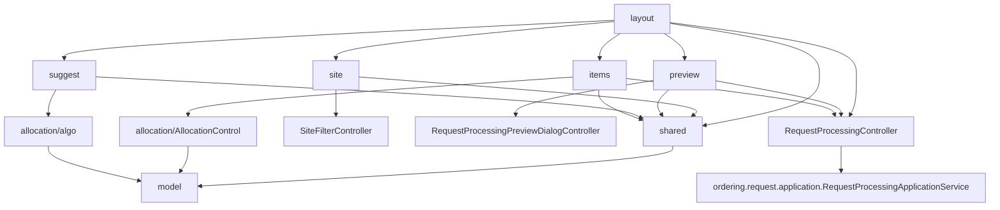

## Mục tiêu

- Mỗi mảng giao diện = 1 folder = 1 FXML + 1 view_controller (FXML controller chứa `@FXML` + handler) + (tuỳ chọn) business controller.
- View_controller chỉ chịu trách nhiệm điều phối UI và gọi business controller; business controller giữ state + logic.
- `RequestProcessingController` (presentation orchestrator) ở root `process/` được view_controllers gọi qua interface callback rõ ràng.
- `AllocationViewSupport` đưa về `shared/` để các module UI dùng chung mà không bị phụ thuộc chéo.

## Cấu trúc thư mục đích

```text
ordering/request/process/
├── RequestProcessingController.java
├── RequestProcessingService.java
├── RequestProcessingGateway.java
│
├── model/           (giữ nguyên)
├── allocation/      (giữ nguyên - business + algo)
│
├── layout/                                NEW
│   ├── request-processing-view.fxml       (chuyển từ process/)
│   └── RequestProcessingLayoutView.java   (đổi tên từ RequestProcessingView)
│
├── site/            (giữ nguyên: SiteFilterView/Controller/Model + FXML)
├── preview/         (giữ nguyên: PreviewDialog/Controller/View + Builder + FXML)
│
├── suggest/                               NEW (list_option = popup tất cả phương án)
│   ├── all-suggest-popup-view.fxml        (chuyển từ ui/)
│   └── AllSuggestPopupView.java           (chuyển từ ui/, tách phần dynamic ra method nhỏ)
│
├── items/                                 NEW (bảng mặt hàng + allocation editor)
│   ├── items-section-view.fxml            NEW (toolbar, header, container động)
│   ├── ItemsSectionView.java              (đổi tên từ RequestProcessingItemsView, FXML-backed)
│   ├── allocation-item-editor-view.fxml   (chuyển từ ui/)
│   ├── AllocationItemEditorView.java      (chuyển từ ui/)
│   └── AllocationSiteRowView.java         (chuyển từ ui/)
│
└── shared/                                NEW
    └── AllocationViewSupport.java         (chuyển từ ui/, đổi package)
```

## Sơ đồ phụ thuộc package (sau refactor)



Phụ thuộc 1 chiều: `layout` → các module con → `shared`/business; `shared` không phụ thuộc UI khác. Không có cycle, đảm bảo low coupling.

## Mapping di chuyển file

- `process/request-processing-view.fxml` → `process/layout/request-processing-view.fxml` (đổi `fx:controller` sang `...layout.RequestProcessingLayoutView`)
- `process/ui/RequestProcessingView.java` → `process/layout/RequestProcessingLayoutView.java`
- `process/ui/AllSuggestPopupView.java` + `process/ui/all-suggest-popup-view.fxml` → `process/suggest/`
- `process/ui/RequestProcessingItemsView.java` → `process/items/ItemsSectionView.java` (tách FXML mới)
- `process/ui/AllocationItemEditorView.java` + `process/ui/allocation-item-editor-view.fxml` → `process/items/`
- `process/ui/AllocationSiteRowView.java` → `process/items/`
- `process/ui/AllocationViewSupport.java` → `process/shared/AllocationViewSupport.java`
- Xoá folder `process/ui/` sau khi rỗng.

## Pattern view_controller áp dụng nhất quán

Mỗi mảng tuân theo cùng 1 contract:

1. FXML khai báo `fx:controller="...XxxView"` và các `fx:id`/`onAction`.
2. `XxxView.java` chỉ chứa `@FXML` field + method handler (nhận event JavaFX). Handler chỉ làm 2 việc: đọc state UI rồi gọi business controller / callback, nhận kết quả rồi cập nhật UI.
3. `XxxController.java` (business / state) không biết tới JavaFX — chỉ nhận data và trả về data/record. Ví dụ pattern đã có trong `preview/RequestProcessingPreviewDialogController` và `site/SiteFilterController`.

Áp dụng:

- **layout/RequestProcessingLayoutView**: handler `goBack()`, `handleConfirm()` → gọi `RequestProcessingController`; method `renderHeader/renderSiteFilterSection/renderItemsViewSection` chỉ làm việc gắn child view vào container.
- **site/SiteFilterView**: giữ nguyên cấu trúc hiện tại, đã đúng pattern.
- **preview/RequestProcessingPreviewDialogView**: giữ nguyên cấu trúc.
- **suggest/AllSuggestPopupView**: giữ FXML controller, handler `closeButton`, `applyButton` → gọi `Consumer<SuggestedPlan>` (callback do layout truyền vào, layout sẽ chuyển tiếp tới `RequestProcessingController.applySelectedPlan`).
- **items/ItemsSectionView**: load `items-section-view.fxml` (toolbar + header + `VBox itemsContainer`). Handler `onOptimizeClicked/onShowAllPlansClicked/onToggleExpand` → gọi callback (lambda) do `RequestProcessingLayoutView` truyền xuống. Mỗi row mặt hàng vẫn build động bằng Java vì phụ thuộc vào số mặt hàng.
- **items/AllocationItemEditorView**: giữ nguyên pattern FXML-backed; chỉ đổi package + import của `AllocationViewSupport` sang `shared`.
- **items/AllocationSiteRowView**: vẫn là helper Java build từng row, đổi package.

## Cụ thể FXML mới cho items

`items-section-view.fxml` (skeleton) sẽ chứa:

```xml
<VBox fx:controller="...items.ItemsSectionView" styleClass="items-section-card">
    <HBox fx:id="toolbar" styleClass="items-section-toolbar">
        <Label text="PHÂN BỔ THEO MẶT HÀNG" .../>
        <Label text="Điều chỉnh tồn kho theo từng yêu cầu" .../>
        <Region HBox.hgrow="ALWAYS"/>
        <Button fx:id="optimizeButton" text="Gợi ý tối ưu" onAction="#handleOptimize"/>
        <Button fx:id="showAllButton" text="Xem tất cả phương án" onAction="#handleShowAllPlans"/>
    </HBox>
    <HBox fx:id="tableHeader" styleClass="items-section-header">...</HBox>
    <VBox fx:id="itemsContainer"/>
</VBox>
```

Các row + allocation editor (đã có FXML riêng) gắn vào `itemsContainer` động.

## Các file ngoài `process/` cần đụng

Bắt buộc nhỏ — chỉ wiring:

- `layout/MainLayoutController` ([src/main/java/org/itss/prj_itss/layout/MainLayoutController.java](src/main/java/org/itss/prj_itss/layout/MainLayoutController.java)) cập nhật:
  - Đường dẫn FXML: `"/org/itss/prj_itss/ordering/request/process/request-processing-view.fxml"` → `"/org/itss/prj_itss/ordering/request/process/layout/request-processing-view.fxml"`.
  - Import + cast `RequestProcessingView` → `RequestProcessingLayoutView`.
- `module-info.java`: nếu cần `opens` package mới cho FXMLLoader (kiểm tra hiện có dùng `opens org.itss.prj_itss.ordering.request.process.ui` không, đổi thành các package mới: `layout`, `suggest`, `items`).
- `target/` build artifact sẽ tự sinh lại.

Không sửa thư mục `warehouse`, `sales`, `auth`.

## Đảm bảo SOLID

- **SRP**: mỗi view_controller chỉ lo binding UI + dispatch event; business controller lo state. Không view nào tự biết cách tính phân bổ.
- **OCP**: thêm section UI mới chỉ cần thêm folder + FXML, layout view_controller compose qua callback chứ không sửa business controller.
- **LSP/ISP**: dùng `Function<AllocationChangeRequest, AllocationChangeResult>`/`Consumer<SuggestedPlan>` làm giao diện nhỏ giữa view và business — view chỉ thấy method nó cần.
- **DIP**: view_controllers phụ thuộc trừu tượng (`Runnable`, `Function`, business controller record/enum), không phụ thuộc framework JavaFX trong business controllers.

## Rủi ro & lưu ý

- Đường dẫn resource trong code (tất cả `getResource("/org/itss/prj_itss/ordering/request/process/...")`) phải đồng bộ với folder FXML mới. Sửa cùng lúc trong: `RequestProcessingPreviewDialog`, `SiteFilterView`, `AllSuggestPopupView`, `AllocationItemEditorView`, và `ItemsSectionView` (mới).
- `module-info.java` đang `opens` package cũ — cần `opens` package mới để FXMLLoader có thể reflect.
- Test `RequestProcessingControllerTest` (đang ở `src/test/java/...process/RequestProcessingControllerTest.java`) không động vào UI nên không ảnh hưởng; smoke test load FXML là chính.
- Sau khi xong: `mvnw test` + chạy app, navigate đến `request-processing:<id>` để kiểm tra load FXML, filter site, hiện popup suggest, mở preview, submit.