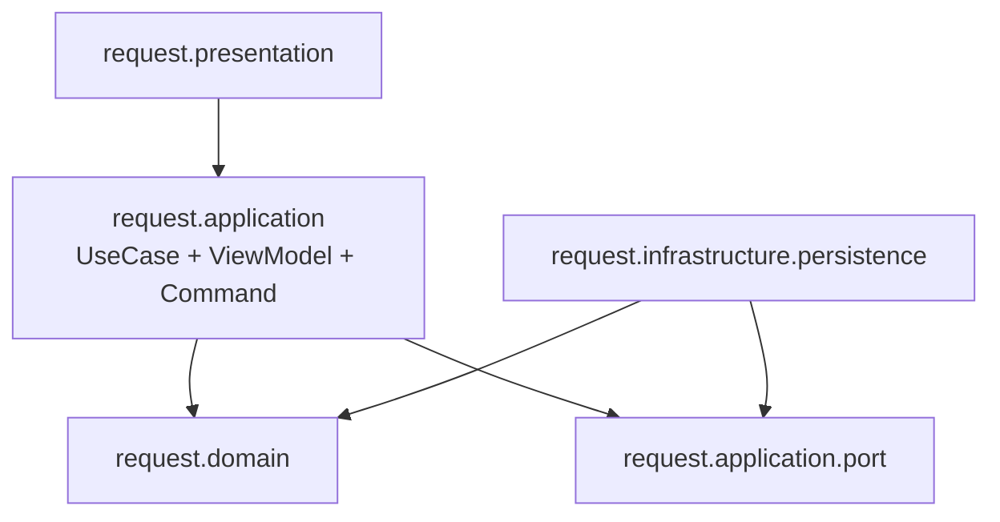

# Refactor `request` Để Presentation Không Phụ Thuộc Domain

## Summary
Refactor toàn bộ `request` theo hướng Practical Clean Architecture: `request.presentation` chỉ gọi `request.application` và dùng DTO/ViewModel của application, không import trực tiếp `request.domain`, `catalog.domain`, `order.domain`, hoặc `site.domain`. `infrastructure` vẫn được map DB sang domain qua application ports, vì đó là adapter bên ngoài implement port; nhưng nó không được gọi application service/use case trực tiếp.

Mermaid đích:

## Key Changes
- Thêm UI-facing models trong `request.application`, không dùng package `dto` top-level:
  `MerchandiseOption`, `RequestItemInput`, `RequestFormView`, `RequestReadOnlyView`, `RequestDetailItemRow`, `AllocatedOrderRow`, `RequestProcessingViewModel`, `ProcessingItemView`, `ProcessingSiteView`, `SuggestedPlanView`, `AllocationChangeCommand`, `AllocationChangeResultView`.
- Thêm application façade cho sales/request screens:
  `RequestSalesApplicationService` phụ thuộc `RequestManagementUseCase` và `CatalogUseCase`, trả về `MerchandiseOption`/form view thay vì `Merchandise`, `Request`, `RequestMerchandise`.
- Refactor request detail:
  `RequestDetailApplicationService` trả về `RequestDetailViewModel` chỉ chứa field render-ready và row model; `RequestDetailPopupController` không tự gọi `CatalogUseCase`, `OrderUseCase`, `SiteUseCase` để dựng bảng.
- Refactor request processing:
  chuyển state/logic đang nằm trong presentation `RequestProcessingController` sang application class mới `RequestProcessingSession`.
  UI chỉ gọi session commands và render application view models; không dùng `AllocationControl`, `Allocation`, `ItemRequirement`, `SiteStockOption`, `SuggestedPlan` trực tiếp.
- Giữ `RequestRepository` và `RequestProcessingGateway` port dùng domain model. `JdbcRequestRepository` và `JdbcRequestProcessingGateway` vẫn import domain để map persistence, nhưng chỉ implement/call `application.port`.
- Tách lỗi gateway khỏi application service:
  thêm `RequestProcessingGatewayException` trong `request.application.port`; gateway ném lỗi này, `RequestProcessingUseCase` wrap sang `RequestProcessingException` cho presentation.

## Architecture Rules
- Cập nhật `CleanArchitectureDependencyTest`:
  `request.presentation` không được import bất kỳ `.domain.` package nào.
- Thêm rule cho infrastructure:
  `request.infrastructure` chỉ được import `request.application.port`, `request.domain`, `common.data/common.config`, và external ports/domain cần cho mapping; không được import `request.application` service/use case.
- Không cấm `infrastructure -> domain`, vì trong Practical Clean adapter được phép tạo domain object để implement port.

## Test Plan
- Chạy `.\mvnw.cmd -q -DskipTests compile`.
- Chạy `.\mvnw.cmd test`.
- Scan bắt buộc:
  `rg -n "import org\\.itss\\.prj_itss\\.(request|catalog|order|site)\\.domain" src/main/java/org/itss/prj_itss/request/presentation`
  phải không còn kết quả.
- Scan infrastructure:
  `rg -n "import org\\.itss\\.prj_itss\\.request\\.application\\.(?!port)" src/main/java/org/itss/prj_itss/request/infrastructure`
  phải không còn kết quả.
- Smoke test thủ công sau implementation: sales list/create/update/view, ordering received/detail/process/preview/submit.

## Assumptions
- Không đổi DB schema, FXML resource path, hoặc luồng điều hướng.
- Không refactor `catalog`, `order`, `site` sâu trong lượt này; chỉ bọc dữ liệu của chúng thành application view model khi đi vào `request.presentation`.
- Chấp nhận `infrastructure -> domain` là đúng hướng Clean Architecture trong repo này; mục tiêu chính là cắt coupling UI với domain internals và chặn infrastructure gọi application service.
