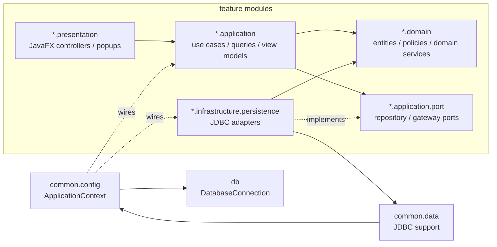

# PRJ_ITSS

Ứng dụng JavaFX quản lý quy trình đặt hàng nhập khẩu, xử lý yêu cầu, phân bổ đơn hàng và xác nhận nhập kho.

## Yêu cầu

- Java 17
- Maven Wrapper (`mvnw` / `mvnw.cmd`)
- Cấu hình database trong `src/main/resources/db.properties`

## Cách chạy

### Windows

```powershell
.\mvnw.cmd clean javafx:run
```

### macOS / Linux

```bash
./mvnw clean javafx:run
```

## Ghi chú

- Dữ liệu chính được đọc từ Supabase PostgreSQL.
- Nếu dùng phần kho, cấu hình thêm các biến `WAREHOUSE_DB_*` hoặc file `warehouse-db.properties`.
- Mã nguồn giao diện nằm trong `src/main/java` và `src/main/resources`.

## Package dependency diagram - Clean Architecture



Quy tac kien truc hien tai:

- `domain` khong phu thuoc JavaFX, SQL, `application`, `presentation`, hoac `infrastructure`.
- `application` khong phu thuoc JavaFX, SQL, `presentation`, hoac concrete adapter trong `infrastructure`.
- `presentation` khong import truc tiep persistence adapter.
- Repository/gateway interface nam trong `*.application.port`; JDBC adapter nam trong `*.infrastructure.persistence`.
- `ApplicationContext` la composition root: tao adapter, tao use case, va wire dependency.