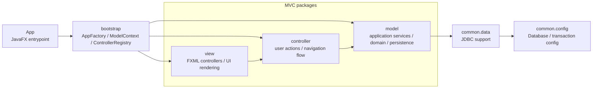

# PRJ_ITSS

Ứng dụng JavaFX quản lý quy trình đặt hàng nhập khẩu, xử lý yêu cầu, phân bổ đơn hàng và xác nhận nhập kho.

## Yêu cầu

- Java 17
- Maven Wrapper (`mvnw` / `mvnw.cmd`)
- Cấu hình database trong `src/main/resources/db.properties`

## Cách chạy

### Windows

```powershell
.\mvnw.cmd clean javafx:run
```

### macOS / Linux

```bash
./mvnw clean javafx:run
```

## Ghi chú

- Dữ liệu chính được đọc từ Supabase PostgreSQL.
- Nếu dùng phần kho, cấu hình thêm các biến `WAREHOUSE_DB_*` hoặc file `warehouse-db.properties`.
- Mã nguồn giao diện nằm trong `src/main/java` và `src/main/resources`.

## Package dependency diagram - MVC



Quy tắc kiến trúc hiện tại:

- `view` chịu trách nhiệm hiển thị giao diện JavaFX, nhận FXML controller và chuyển thao tác người dùng sang `controller`.
- `controller` điều phối luồng xử lý, gọi use case hoặc service trong `model`, đồng thời điều hướng màn hình khi cần.
- `model` chứa nghiệp vụ chính: application service/use case, domain object, port và JDBC adapter.
- `bootstrap` là nơi lắp ghép ứng dụng: `AppFactory` tải view, `ControllerRegistry` tạo controller, `ModelContext` tạo model service và repository.
- `common.config` và `common.data` chỉ cung cấp hạ tầng dùng chung như kết nối database, transaction và JDBC helper.
