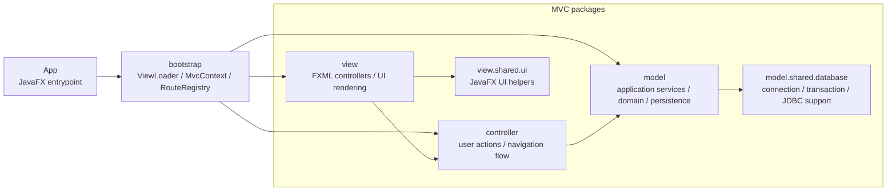

# PRJ_ITSS

Ứng dụng JavaFX quản lý quy trình đặt hàng nhập khẩu, xử lý yêu cầu, phân bổ đơn hàng và xác nhận nhập kho.

## Yêu cầu

- Java 17
- Maven Wrapper (`mvnw` / `mvnw.cmd`)
- Cấu hình database trong `src/main/resources/db.properties`

## Cách chạy

### Windows

```powershell
.\mvnw.cmd clean javafx:run
```

### macOS / Linux

```bash
./mvnw clean javafx:run
```

## Ghi chú

- Dữ liệu chính được đọc từ Supabase PostgreSQL.
- Nếu dùng phần kho, cấu hình thêm các biến `WAREHOUSE_DB_*` hoặc file `warehouse-db.properties`.
- Mã nguồn giao diện nằm trong `src/main/java` và `src/main/resources`.

## Package dependency diagram - MVC



## Quy tắc kiến trúc hiện tại

Hệ thống được thiết kế theo mô hình **MVC (Model-View-Controller)** kết hợp với các nguyên lý của **Clean Architecture / Hexagonal Architecture** (ở tầng Model) nhằm đảm bảo tính dễ bảo trì, dễ kiểm thử và độc lập công nghệ:

### 1. Phân rã các lớp chính (MVC)
- **`view`**: Đảm nhận hiển thị giao diện JavaFX (FXML), quản lý trạng thái UI cục bộ và chuyển tiếp các tương tác của người dùng đến **`controller`** tương ứng được tiêm (inject) vào. Tầng này không chứa logic nghiệp vụ.
- **`controller`**: Điều phối luồng xử lý (flow control), tiếp nhận sự kiện từ View, gọi các Application Service/Use Case trong **`model`**, và điều hướng màn hình thông qua `Navigator`. Controller hoàn toàn độc lập với công nghệ JavaFX và không import trực tiếp các class thuộc tầng `view`.
- **`model`**: Nơi chứa toàn bộ logic nghiệp vụ cốt lõi của ứng dụng (Core Business Logic), bao gồm Application Services, Domain Entities, Ports và Infrastructure Adapters.
- **`bootstrap`**: Đóng vai trò là **Composition Root** của ứng dụng:
  - `MvcContext`: Lắp ghép thủ công các module, controller và route (thay thế cho Spring IoC container để giảm overhead).
  - `RouteRegistry`: Quản lý việc tải và ánh xạ các màn hình.
  - `ViewLoader`: Tải giao diện cơ sở (shell login, main layout).
- **`model.shared.database` & `view.shared.ui`**: Các module dùng chung (shared) được tách biệt rõ ràng nhằm duy trì tính gắn kết (cohesion) cao trong toàn bộ hệ thống.

---

### 2. Kiến trúc chi tiết tầng nghiệp vụ (`model/request`)
Để chuẩn hóa mô hình thiết kế và áp dụng các nguyên lý **SOLID**, phân hệ xử lý yêu cầu (`model/request`) đã được refactor sâu sắc theo cấu trúc **Ports & Adapters**:

#### A. Lớp Domain (`model/request/domain`)
- **Rich Domain Model (Mô hình miền phong phú)**: 
  - Thực thể `Request` tự đóng gói (encapsulate) các thuộc tính và trực tiếp quản lý vòng đời trạng thái của chính nó thông qua các phương thức nghiệp vụ như `startProcessing()` và `complete()`, thay vì sử dụng các setter tự do từ bên ngoài (giúp tránh hiện tượng *Anemic Domain Model*).
- **RequestStatus (Enum type-safe)**:
  - Quản lý tập hợp các trạng thái hợp lệ của yêu cầu (`PENDING`, `PROCESSING`, `COMPLETED`, `REJECTED`).
  - Tự định nghĩa logic ánh xạ dữ liệu lưu trữ thông qua `storageValue()` và `fromStorageValue()`, giúp cô lập định dạng database khỏi logic ứng dụng.
- **Domain Logic (`AllocationControl`)**:
  - Đóng gói thuật toán và các điều kiện phân bổ đơn hàng, áp dụng các quy tắc kiểm tra tính hợp lệ và đề xuất phương án tối ưu một cách độc lập.

#### B. Lớp Application (`model/request/application`)
- Định nghĩa các luồng nghiệp vụ thông qua các Use Case / Application Service (như `ReceivedRequestsApplicationService`, `RequestSalesApplicationService`, `RequestDetailApplicationService`).
- Định nghĩa các **Ports** (Cổng giao tiếp) dạng Interface (ví dụ: `RequestRepository`) mô tả các hành vi lưu trữ dữ liệu cần thiết mà không quan tâm đến công nghệ cơ sở dữ liệu cụ thể nào.

#### C. Lớp Infrastructure (`model/request/infrastructure`)
- Chứa các **Adapters** (Bộ chuyển đổi) thực thi các Ports ở tầng Application (ví dụ: `JdbcRequestRepository`, `JdbcRequestProcessingGateway`).
- Sử dụng JDBC kết nối trực tiếp với PostgreSQL/Supabase. Mọi chi tiết kỹ thuật về SQL, ResultSet và ánh xạ dữ liệu đều được cô lập hoàn toàn trong tầng này, giúp dễ dàng thay thế sang các công nghệ ORM khác mà không ảnh hưởng tới tầng Domain và Application.

#### D. Composition Root của Module (`RequestModule`)
- Ráp nối thủ công (Manual Dependency Injection) các Adapter (`JdbcRequestRepository`, `JdbcRequestProcessingGateway`) vào các Application Service và Controller tương ứng, giúp giảm thiểu sự phụ thuộc vào các thư viện DI bên thứ ba và tăng tốc độ khởi động ứng dụng.

