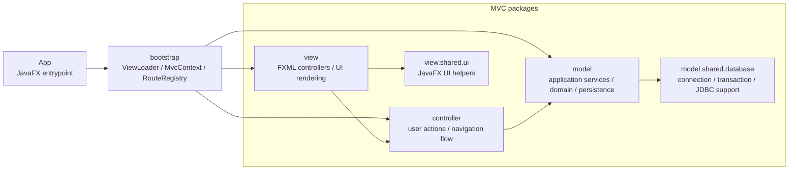

# PRJ_ITSS

Ứng dụng JavaFX quản lý quy trình đặt hàng nhập khẩu, xử lý yêu cầu, phân bổ đơn hàng và xác nhận nhập kho.

## Yêu cầu

- Java 17
- Maven Wrapper (`mvnw` / `mvnw.cmd`)
- Cấu hình database trong `src/main/resources/db.properties`

## Cách chạy

### Windows

```powershell
.\mvnw.cmd clean javafx:run
```

### macOS / Linux

```bash
./mvnw clean javafx:run
```

## Ghi chú

- Dữ liệu chính được đọc từ Supabase PostgreSQL.
- Nếu dùng phần kho, cấu hình thêm các biến `WAREHOUSE_DB_*` hoặc file `warehouse-db.properties`.
- Mã nguồn giao diện nằm trong `src/main/java` và `src/main/resources`.

## Package dependency diagram - MVC



Quy tac kien truc hien tai:

- `view` hien thi JavaFX, giu UI state, va chuyen thao tac nguoi dung sang `controller` da duoc inject.
- `controller` dieu phoi flow, goi use case/service trong `model`, va dieu huong qua `Navigator`; controller khong import `view` hoac JavaFX.
- `model` chua nghiep vu chinh: application service/use case, domain object, port, JDBC adapter, va `model.shared.database` cho database/transaction.
- `bootstrap` la composition root: `MvcContext` lap ghep module/controller/route, `RouteRegistry` load va wire man hinh, `ViewLoader` chi load shell login/main layout.
- `common` top-level da duoc tach vao `model.shared.*` va `view.shared.ui` de giu cohesion theo MVC.
