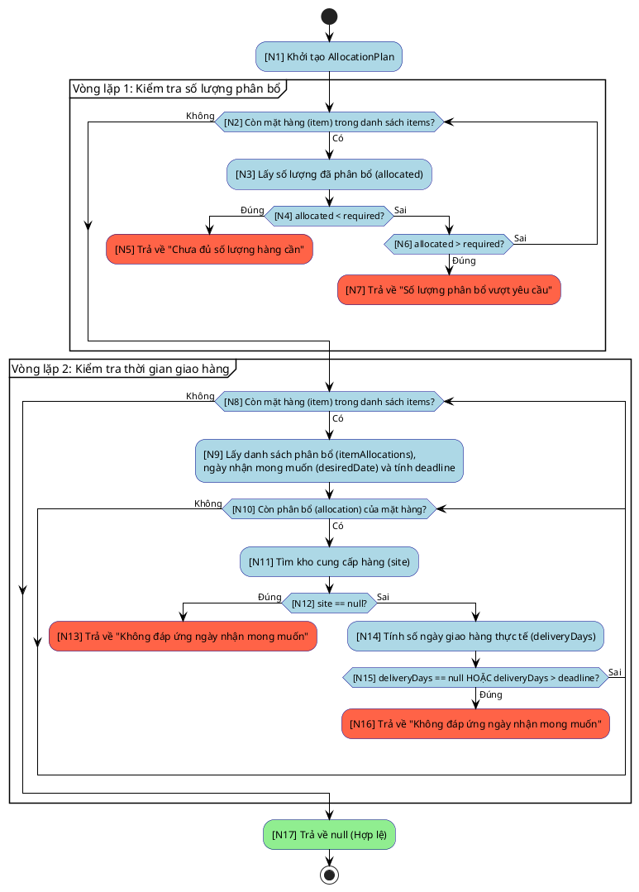

# Thiết kế kiểm thử `DefaultAllocationValidator`

## 1. Tóm tắt

Module được chọn nằm trong luồng xử lý yêu cầu đặt hàng:

```text
org.itss.prj_itss.model.request.domain.processing.allocation.validator.DefaultAllocationValidator
```

Tài liệu này tập trung kiểm thử phương thức:

```java
validateSubmission(...)
```

Lý do chọn phương thức này:

- Đây là bước kiểm tra phân bổ cuối cùng trong luồng UC xử lý yêu cầu đặt hàng khi người dùng bấm nút xác nhận tạo đơn hàng, có vai trò nghiệp vụ rõ ràng và ảnh hưởng trực tiếp đến tính đúng đắn của yêu cầu.
- Đây là logic domain thuần Java, không phụ thuộc JavaFX hay database.
- Phương thức có đủ các nhánh nghiệp vụ để áp dụng kiểm thử hộp đen bằng bảng quyết định, và đủ cấu trúc điều khiển để áp dụng kiểm thử hộp trắng bằng đồ thị luồng điều khiển.

Hai kỹ thuật kiểm thử được áp dụng **độc lập**:

1. **Hộp đen — Bảng quyết định (Decision Table):** thiết kế từ đặc tả nghiệp vụ, không nhìn vào code.
2. **Hộp trắng — Luồng điều khiển (Control Flow):** thiết kế từ đồ thị luồng điều khiển (CFG), xác định đường đi độc lập theo phương pháp đường cơ sở của McCabe.

Sau khi thiết kế xong cả hai, tài liệu so sánh hai bộ test case.

Class kiểm thử tự động đầy đủ:

```text
org.itss.prj_itss.model.request.domain.processing.allocation.validator.DefaultAllocationValidatorTest
```

---

## 2. Mô tả lớp và phương thức cần kiểm thử

`DefaultAllocationValidator` có nhiệm vụ kiểm tra việc phân bổ hàng trước khi người dùng xác nhận tạo đơn hàng. Trong luồng UC xử lý yêu cầu đặt hàng, lớp này được dùng khi hệ thống cần biết dữ liệu phân bổ hiện tại đã đủ điều kiện gửi đi hay chưa.

Dưới đây là mã nguồn đầy đủ của lớp `DefaultAllocationValidator` (`src/main/java/org/itss/prj_itss/model/request/domain/processing/allocation/validator/DefaultAllocationValidator.java`):

```java
package org.itss.prj_itss.model.request.domain.processing.allocation.validator;

import org.itss.prj_itss.model.request.domain.processing.allocation.Allocation;
import org.itss.prj_itss.model.request.domain.processing.allocation.AllocationPlan;
import org.itss.prj_itss.model.request.domain.delivery.DeliveryOptions;
import org.itss.prj_itss.model.request.domain.processing.ItemRequirement;
import org.itss.prj_itss.model.request.domain.processing.SiteStockOption;

import java.time.LocalDate;
import java.time.temporal.ChronoUnit;
import java.util.ArrayList;
import java.util.List;
import java.util.Map;

public final class DefaultAllocationValidator implements AllocationValidator {
    @Override
    public List<String> validateAllocations(
        List<ItemRequirement> items,
        Map<Integer, Map<Integer, Allocation>> allocations
    ) {
        AllocationPlan plan = AllocationPlan.using(allocations);
        List<String> errors = new ArrayList<>();
        for (ItemRequirement item : items) {
            int allocated = plan.allocatedQuantity(item.merchandiseId);
            if (allocated < item.required) {
                errors.add("- " + item.code + " chỉ phân bổ " + allocated + "/" + item.required);
            }
            if (allocated > item.required) {
                errors.add("- " + item.code + " phân bổ vượt " + allocated + "/" + item.required);
            }
        }
        return errors;
    }

    @Override
    public String validateSubmission(
        List<ItemRequirement> items,
        List<SiteStockOption> allSites,
        Map<Integer, Map<Integer, Allocation>> allocations,
        Map<Integer, LocalDate> desiredDeliveryDates
    ) {
        AllocationPlan plan = AllocationPlan.using(allocations);
        for (ItemRequirement item : items) {
            int allocated = plan.allocatedQuantity(item.merchandiseId);
            if (allocated < item.required) {
                return "Chưa đủ số lượng hàng cần";
            }
            if (allocated > item.required) {
                return "Số lượng phân bổ vượt yêu cầu";
            }
        }

        for (ItemRequirement item : items) {
            Map<Integer, Allocation> itemAllocations = allocations.getOrDefault(item.merchandiseId, Map.of());
            if (itemAllocations.isEmpty()) {
                continue;
            }

            LocalDate desiredDate = desiredDeliveryDates.get(item.merchandiseId);
            if (desiredDate == null) {
                continue;
            }

            int itemDeadlineDays = (int) ChronoUnit.DAYS.between(LocalDate.now(), desiredDate);
            for (Allocation allocation : itemAllocations.values()) {
                SiteStockOption site = allSites.stream()
                    .filter(candidate -> candidate.id == allocation.siteId)
                    .findFirst()
                    .orElse(null);
                if (site == null) {
                    return "Không đáp ứng ngày nhận mong muốn";
                }

                int deliveryDays = DeliveryOptions.deliveryDays(
                    site,
                    DeliveryOptions.resolve(site, allocation.transport, itemDeadlineDays)
                );
                if (deliveryDays >= 999 || deliveryDays > itemDeadlineDays) {
                    return "Không đáp ứng ngày nhận mong muốn";
                }
            }
        }

        return null;
    }
}
```

Các đầu vào chính của phương thức `validateSubmission(...)`:

| Tham số | Kiểu dữ liệu | Ý nghĩa |
|---|---|---|
| `items` | `List<ItemRequirement>` | Danh sách mặt hàng cần xử lý, mỗi item có mã hàng và số lượng yêu cầu |
| `allSites` | `List<SiteStockOption>` | Danh sách site có thể cung cấp hàng, kèm thời gian vận chuyển |
| `allocations` | `Map<Integer, Map<Integer, Allocation>>` | Thông tin phân bổ: với mỗi mặt hàng, ghi rõ từng kho sẽ cung cấp bao nhiêu sản phẩm và bằng phương thức vận chuyển nào |
| `desiredDeliveryDates` | `Map<Integer, LocalDate>` | Bản đồ lưu ngày nhận mong muốn theo từng mặt hàng |

Kết quả trả về:

| Trường hợp | Kết quả |
|---|---|
| Phân bổ hợp lệ | `null` |
| Thiếu số lượng | `"Chưa đủ số lượng hàng cần"` |
| Thừa số lượng | `"Số lượng phân bổ vượt yêu cầu"` |
| Site hoặc thời gian giao hàng không đáp ứng | `"Không đáp ứng ngày nhận mong muốn"` |

---

## 3. Kiểm thử hộp đen — Bảng quyết định (Decision Table)

Ở phần kiểm thử hộp đen, chúng ta xét phương thức qua đặc tả nghiệp vụ mà không nhìn vào cấu trúc mã nguồn bên trong. Kỹ thuật được dùng là bảng quyết định: liệt kê các điều kiện nghiệp vụ, xác định tất cả tổ hợp điều kiện có ý nghĩa, và thiết kế một test case cho mỗi quy tắc.

### 3.1. Xác định điều kiện và hành động

**Điều kiện:**

| Ký hiệu | Điều kiện |
|---|---|
| C1 | Tổng phân bổ < số lượng yêu cầu (`allocated < required`) |
| C2 | Tổng phân bổ > số lượng yêu cầu (`allocated > required`) |
| C3 | Site phân bổ không tồn tại trong `allSites` (`site == null`) |
| C4 | Site không hỗ trợ phương thức vận chuyển được chọn (`deliveryDays == null`) |
| C5 | Giao hàng trễ hơn ngày mong muốn (`deliveryDays > itemDeadlineDays`) |

Quan hệ phụ thuộc giữa các điều kiện: C1 và C2 loại trừ nhau — một số lượng không thể vừa nhỏ hơn vừa lớn hơn yêu cầu. C3, C4, C5 chỉ được kiểm tra khi C1 = Không và C2 = Không, vì phương thức trả về lỗi số lượng sớm nếu C1 hoặc C2 đúng. C4 và C5 được kiểm tra trong cùng điều kiện `||` — khi C4 đúng (`deliveryDays == null`), C5 không ảnh hưởng đến kết quả.

**Hành động:**

| Ký hiệu | Hành động |
|---|---|
| A1 | Trả về `null` |
| A2 | Trả về `"Chưa đủ số lượng hàng cần"` |
| A3 | Trả về `"Số lượng phân bổ vượt yêu cầu"` |
| A4 | Trả về `"Không đáp ứng ngày nhận mong muốn"` |

### 3.2. Bảng quyết định

| Điều kiện / Hành động | **TC1** | **TC2** | **TC3** | **TC4** | **TC5** | **TC6** |
|---|:---:|:---:|:---:|:---:|:---:|:---:|
| C1: `allocated < required` | Có | Không | Không | Không | Không | Không |
| C2: `allocated > required` | — | Có | Không | Không | Không | Không |
| C3: `site == null` | — | — | Có | Không | Không | Không |
| C4: `deliveryDays >= 999` | — | — | — | Có | Không | Không |
| C5: `deliveryDays > deadline` | — | — | — | — | Có | Không |
| **A1: `null`** | | | | | | **X** |
| **A2: "Chưa đủ..."** | **X** | | | | | |
| **A3: "Thừa..."** | | **X** | | | | |
| **A4: "Không đáp ứng..."** | | | **X** | **X** | **X** | |

Ký hiệu `—` có nghĩa điều kiện không ảnh hưởng đến kết quả vì phương thức đã rẽ nhánh kết thúc trước khi kiểm tra điều kiện đó.

Bảng quyết định cho **6 quy tắc → 6 test case hộp đen**.

*Lưu ý:* Trường hợp `items` rỗng không được biểu diễn trong bảng vì khi đó các vòng lặp không chạy và không có điều kiện nào trong C1–C5 được kiểm tra. Đây là trường hợp cấu trúc đặc thù, không phải quy tắc nghiệp vụ rõ ràng — kiểm thử hộp trắng sẽ phát hiện và bao phủ trường hợp này.

### 3.3. Danh sách test case hộp đen

| Mã TC | Quy tắc | Tên test JUnit | Dữ liệu kiểm thử | Kết quả mong đợi |
|---|:---:|---|---|---|
| DT_01 | TC1 | `validateSubmission_shouldReturnMissingQuantityMessage_whenAllocationBelowRequirement` | `required=10`, `allocated=9` | `"Chưa đủ số lượng hàng cần"` |
| DT_02 | TC2 | `validateSubmission_shouldReturnExcessQuantityMessage_whenAllocationAboveRequirement` | `required=10`, `allocated=11` | `"Số lượng phân bổ vượt yêu cầu"` |
| DT_03 | TC3 | `validateSubmission_shouldReturnDeliveryMessage_whenSiteCannotBeFound` | `siteId=999`, `allSites` chỉ có `id=101` | `"Không đáp ứng ngày nhận mong muốn"` |
| DT_04 | TC4 | `validateSubmission_shouldReturnDeliveryMessage_whenTransportIsUnsupported` | Site `shipDays=null` (không hỗ trợ đường biển), allocation chọn ship | `"Không đáp ứng ngày nhận mong muốn"` |
| DT_05 | TC5 | `validateSubmission_shouldReturnDeliveryMessage_whenDeliveryExceedsDesiredDeadline` | `shipDays=5`, deadline `3` ngày | `"Không đáp ứng ngày nhận mong muốn"` |
| DT_06 | TC6 | `validateSubmission_shouldReturnNull_whenFutureDesiredDateCanBeMet` | `airDays=3`, deadline `5` ngày | `null` |

---

## 4. Kiểm thử hộp trắng — Luồng điều khiển (Control Flow)

Ở phần hộp trắng, chúng ta phân tích cấu trúc điều khiển trong mã nguồn của `validateSubmission(...)` và xây dựng đồ thị luồng điều khiển (CFG). Từ CFG, chúng ta tính độ phức tạp vòng theo phương pháp McCabe để xác định số đường đi độc lập cần kiểm thử, sau đó thiết kế một test case cho mỗi đường đi.

### 4.1. Mã nguồn gắn nhãn các nút (Nodes)

Dưới đây là mã nguồn của phương thức `validateSubmission(...)` cùng các điểm gắn nhãn nút điều khiển tương ứng để tiện ánh xạ vào đồ thị:

```java
    @Override
    public String validateSubmission(
        List<ItemRequirement> items,
        List<SiteStockOption> allSites,
        Map<Integer, Map<Integer, Allocation>> allocations,
        Map<Integer, LocalDate> desiredDeliveryDates
    ) {
        // [N1]
        AllocationPlan plan = AllocationPlan.using(allocations);
        
        // [N2] Vòng lặp 1: Duyệt danh sách mặt hàng để kiểm tra số lượng
        for (ItemRequirement item : items) {
            // [N3]
            int allocated = plan.allocatedQuantity(item.merchandiseId);
            
            // [N4]
            if (allocated < item.required) {
                // [N5]
                return "Chưa đủ số lượng hàng cần";
            }
            // [N6]
            if (allocated > item.required) {
                // [N7]
                return "Số lượng phân bổ vượt yêu cầu";
            }
        }

        // [N8] Vòng lặp 2: Duyệt danh sách mặt hàng để kiểm tra thời hạn giao hàng
        for (ItemRequirement item : items) {
            // [N9]
            Map<Integer, Allocation> itemAllocations = allocations.getOrDefault(item.merchandiseId, Map.of());
            if (itemAllocations.isEmpty()) {
                continue;
            }

            LocalDate desiredDate = desiredDeliveryDates.get(item.merchandiseId);
            if (desiredDate == null) {
                continue;
            }

            int itemDeadlineDays = (int) ChronoUnit.DAYS.between(LocalDate.now(), desiredDate);
            
            // [N10] Vòng lặp lồng trong: Duyệt qua các phân bổ cụ thể của mặt hàng
            for (Allocation allocation : itemAllocations.values()) {
                // [N11]
                SiteStockOption site = allSites.stream()
                    .filter(candidate -> candidate.id == allocation.siteId)
                    .findFirst()
                    .orElse(null);
                
                // [N12]
                if (site == null) {
                    // [N13]
                    return "Không đáp ứng ngày nhận mong muốn";
                }

                // [N14]
                int deliveryDays = DeliveryOptions.deliveryDays(
                    site,
                    DeliveryOptions.resolve(site, allocation.transport, itemDeadlineDays)
                );
                
                // [N15]
                if (deliveryDays >= 999 || deliveryDays > itemDeadlineDays) {
                    // [N16]
                    return "Không đáp ứng ngày nhận mong muốn";
                }
            }
        }

        // [N17]
        return null;
    }
```

#### Bảng chú thích nút (Node legend)

Bảng dưới ánh xạ nhanh mỗi nút `N#` sang vai trò trong mã nguồn, để tiện đọc đường đi ở mục 4.4 mà không phải dò lại code:

| Nút | Vai trò | Loại nút |
|:---:|---|:---:|
| N1 | Khởi tạo `AllocationPlan` | Tuần tự |
| N2 | Vòng lặp 1 — còn `item`? | **Quyết định** |
| N3 | Lấy `allocated` | Tuần tự |
| N4 | `allocated < required`? | **Quyết định** |
| N5 | return `"Chưa đủ số lượng hàng cần"` | Kết thúc |
| N6 | `allocated > required`? | **Quyết định** |
| N7 | return `"Số lượng phân bổ vượt yêu cầu"` | Kết thúc |
| N8 | Vòng lặp 2 — còn `item`? | **Quyết định** |
| N9 | Lấy `itemAllocations`, `desiredDate`, tính `deadline` (bỏ qua nếu rỗng/null) | Tuần tự |
| N10 | Vòng lặp trong — còn `allocation`? | **Quyết định** |
| N11 | Tìm `site` cung cấp hàng | Tuần tự |
| N12 | `site == null`? | **Quyết định** |
| N13 | return `"Không đáp ứng ngày nhận mong muốn"` | Kết thúc |
| N14 | Tính `deliveryDays` | Tuần tự |
| N15 | `deliveryDays == null` hoặc `> deadline`? | **Quyết định** |
| N16 | return `"Không đáp ứng ngày nhận mong muốn"` | Kết thúc |
| N17 | return `null` (hợp lệ) | Kết thúc |

7 nút quyết định in đậm chính là 7 điểm rẽ nhánh dùng để tính độ phức tạp vòng ở mục 4.3.

### 4.2. Đồ thị luồng điều khiển (Control Flow Graph - CFG)

Dưới đây là các sơ đồ biểu diễn Đồ thị luồng điều khiển (CFG) của phương thức:

#### Sơ đồ dạng Mermaid:

```mermaid
flowchart TD
    N1([N1: Bắt đầu]) --> N2{N2: Vòng lặp 1 - items còn?}
    
    N2 -- Có --> N3[N3: Lấy allocated quantity]
    N3 --> N4{N4: allocated < required?}
    
    N4 -- Đúng --> N5([N5: Trả về "Chưa đủ số lượng hàng cần"])
    N4 -- Sai --> N6{N6: allocated > required?}
    
    N6 -- Đúng --> N7([N7: Trả về "Số lượng phân bổ vượt yêu cầu"])
    N6 -- Sai --> N2
    
    N2 -- Không --> N8{N8: Vòng lặp 2 - items còn?}
    N8 -- Không --> N17([N17: Trả về null])
    
    N8 -- Có --> N9[N9: Khởi tạo thông tin & Lấy deadline]
    N9 --> N10{N10: Vòng lặp trong - allocations còn?}
    
    N10 -- Không --> N8
    N10 -- Có --> N11[N11: Lấy site phân bổ tương ứng]
    N11 --> N12{N12: site == null?}
    
    N12 -- Đúng --> N13([N13: Trả về "Không đáp ứng ngày nhận mong muốn"])
    N12 -- Sai --> N14[N14: Tính deliveryDays]
    
    N14 --> N15{N15: deliveryDays == null hoặc deliveryDays > deadline?}
    N15 -- Đúng --> N16([N16: Trả về "Không đáp ứng ngày nhận mong muốn"])
    N15 -- Sai --> N10
```

#### Sơ đồ dạng PlantUML (Activity Diagram):



Các cạnh chuyển tiếp trong CFG:

```text
N1  → N2
N2  → N3   (Có: vào thân vòng lặp 1)
N2  → N8   (Không: thoát vòng lặp 1)
N3  → N4
N4  → N5   (Có: allocated < required)
N4  → N6   (Không)
N6  → N7   (Có: allocated > required)
N6  → N2   (Không: lặp tiếp vòng 1)
N8  → N9   (Có: vào thân vòng lặp 2)
N8  → N17  (Không: thoát vòng lặp 2)
N9  → N10
N10 → N11  (Có: vào thân vòng lặp trong)
N10 → N8   (Không: thoát vòng lặp trong, lặp tiếp vòng 2)
N11 → N12
N12 → N13  (Có: site == null)
N12 → N14  (Không)
N14 → N15
N15 → N16  (Có: điều kiện giao hàng vi phạm)
N15 → N10  (Không: lặp tiếp vòng trong)
```

### 4.3. Độ phức tạp vòng và số đường đi độc lập

Các nút quyết định trong CFG: **N2, N4, N6, N8, N10, N12, N15** — tổng cộng **7 nút quyết định**.

Độ phức tạp vòng (McCabe):

```text
V(G) = số nút quyết định + 1 = 7 + 1 = 8
```

Phương thức cần **8 đường đi độc lập** để đảm bảo độ phủ đường cơ sở.

### 4.4. Các đường đi độc lập

| Mã đường | Chuỗi nút | Điều kiện kích hoạt |
|---|---|---|
| P1 | N1→N2→N8→N17 | `items` là danh sách rỗng (`List.of()`); hai vòng lặp không chạy, phương thức trả về `null` ngay. |
| P2 | N1→N2→N3→N4→N5 | Có 1 item với `required=10`, tổng `allocated=9` (biên dưới: `required - 1`) → thiếu số lượng. |
| P3 | N1→N2→N3→N4→N6→N7 | Có 1 item với `required=10`, tổng `allocated=11` (biên trên: `required + 1`) → thừa số lượng. |
| P4 | N1→N2→N3→N4→N6→N2→N8→N9→N10→N8→N17 | `required=0`, `allocations` rỗng; số lượng khớp, `itemAllocations` trống → vòng lặp trong không chạy, trả về `null`. |
| P5 | N1→N2→N3→N4→N6→N2→N8→N9→N10→N11→N12→N13 | Số lượng khớp; allocation chỉ định `siteId=999` không có trong `allSites` (chỉ có `id=101`) → `site == null`. |
| P6 | N1→N2→N3→N4→N6→N2→N8→N9→N10→N11→N12→N14→N15→N16 | Số lượng khớp; site tồn tại nhưng `shipDays=null` (không hỗ trợ đường biển) → `deliveryDays == null`. |
| P7 | N1→N2→N3→N4→N6→N2→N8→N9→N10→N11→N12→N14→N15→N16 | Số lượng khớp; `desiredDate` sau 3 ngày nhưng site `shipDays=5` → `deliveryDays=5 > itemDeadlineDays=3`. |
| P8 | N1→N2→N3→N4→N6→N2→N8→N9→N10→N11→N12→N14→N15→N10→N8→N17 | Số lượng khớp; `desiredDate` sau 5 ngày, site `airDays=3` → `deliveryDays=3 ≤ itemDeadlineDays=5`, tất cả hợp lệ. |

P6 và P7 có cùng chuỗi nút vì cả hai đều thoát qua N15→N16; sự khác biệt: P6 kích hoạt vế `deliveryDays == null` (site không hỗ trợ phương thức vận chuyển), P7 kích hoạt vế `deliveryDays > deadline` (giao trễ hạn) — cần hai test case riêng để đạt độ phủ điều kiện tại N15.

### 4.6. Kết luận độ phủ nhánh C1

Để chứng minh bộ 8 đường đi đạt **100% bao phủ nhánh / quyết định (C1)**, bảng dưới liệt kê từng nhánh `Đúng`/`Sai` của 7 nút quyết định và đường đi (test case) kích hoạt nó. C1 yêu cầu mỗi nhánh được thực thi ít nhất một lần.

| Nút quyết định | Nhánh Đúng (test phủ) | Nhánh Sai (test phủ) |
|:---:|---|---|
| N2: còn item? | P2 (CF_02) | P1 (CF_01) |
| N4: `allocated < required` | P2 (CF_02) | P3 (CF_03) |
| N6: `allocated > required` | P3 (CF_03) | P4 (CF_04) |
| N8: còn item? | P4 (CF_04) | P1 (CF_01) |
| N10: còn allocation? | P5 (CF_05) | P4 (CF_04) |
| N12: `site == null` | P5 (CF_05) | P6 (CF_06) |
| N15: `deliveryDays == null \|\| > deadline` | P6, P7 (CF_06, CF_07) | P8 (CF_08) |

**Tổng số nhánh:** 7 nút × 2 = **14 nhánh**. Cả 14 nhánh đều có ít nhất một đường đi kích hoạt.

→ **Độ phủ nhánh C1 = 14/14 = 100%.**

Ngoài ra, vì mỗi nhánh đều được phủ nên độ phủ câu lệnh C0 cũng đạt 100% (mọi nút N1–N17 đều nằm trên ít nhất một đường đi đã chọn). Riêng nút quyết định kép N15 còn được phủ ở **mức điều kiện**: vế `deliveryDays == null` (P6) và vế `deliveryDays > deadline` (P7) được kiểm thử độc lập, vượt yêu cầu tối thiểu của C1.

### 4.7. Danh sách test case hộp trắng

| Mã TC | Đường đi | Tên test JUnit | Dữ liệu kiểm thử | Kết quả mong đợi |
|---|:---:|---|---|---|
| CF_01 | P1 | `validateSubmission_shouldReturnNull_whenItemsAreEmpty` | `items = []` | `null` |
| CF_02 | P2 | `validateSubmission_shouldReturnMissingQuantityMessage_whenAllocationBelowRequirement` | `required=10`, `allocated=9` | `"Chưa đủ số lượng hàng cần"` |
| CF_03 | P3 | `validateSubmission_shouldReturnExcessQuantityMessage_whenAllocationAboveRequirement` | `required=10`, `allocated=11` | `"Số lượng phân bổ vượt yêu cầu"` |
| CF_04 | P4 | `validateSubmission_shouldReturnNull_whenZeroRequirementHasNoAllocations` | `required=0`, `allocations = {}` | `null` |
| CF_05 | P5 | `validateSubmission_shouldReturnDeliveryMessage_whenSiteCannotBeFound` | `siteId=999`, `allSites` chỉ có `id=101` | `"Không đáp ứng ngày nhận mong muốn"` |
| CF_06 | P6 | `validateSubmission_shouldReturnDeliveryMessage_whenTransportIsUnsupported` | Site `shipDays=null`, allocation chọn ship | `"Không đáp ứng ngày nhận mong muốn"` |
| CF_07 | P7 | `validateSubmission_shouldReturnDeliveryMessage_whenDeliveryExceedsDesiredDeadline` | `shipDays=5`, deadline `3` ngày | `"Không đáp ứng ngày nhận mong muốn"` |
| CF_08 | P8 | `validateSubmission_shouldReturnNull_whenFutureDesiredDateCanBeMet` | `airDays=3`, deadline `5` ngày | `null` |

---

## 5. So sánh hai phương pháp

### 5.1. Bảng đối chiếu test case

| Mã DT (Hộp đen) | Mã CF (Hộp trắng) tương ứng | Tên JUnit method | Kịch bản / Mô tả |
|---|---|---|---|
| — | CF_01 | `..._shouldReturnNull_whenItemsAreEmpty` | `items` rỗng |
| DT_01 | CF_02 | `..._shouldReturnMissingQuantityMessage_whenAllocationBelowRequirement` | `allocated < required` |
| DT_02 | CF_03 | `..._shouldReturnExcessQuantityMessage_whenAllocationAboveRequirement` | `allocated > required` |
| — | CF_04 | `..._shouldReturnNull_whenZeroRequirementHasNoAllocations` | Vòng lặp trong không chạy |
| DT_03 | CF_05 | `..._shouldReturnDeliveryMessage_whenSiteCannotBeFound` | `site == null` |
| DT_04 | CF_06 | `..._shouldReturnDeliveryMessage_whenTransportIsUnsupported` | `deliveryDays == null` (site không hỗ trợ) |
| DT_05 | CF_07 | `..._shouldReturnDeliveryMessage_whenDeliveryExceedsDesiredDeadline` | `deliveryDays > deadline` |
| DT_06 | CF_08 | `..._shouldReturnNull_whenFutureDesiredDateCanBeMet` | Happy path |

Sáu test case của hộp đen đều có tương đương trong hộp trắng. Hai test case CF_01 và CF_04 chỉ xuất hiện trong hộp trắng do liên quan đến biên vòng lặp (vòng lặp không chạy).

### 5.2. So sánh theo tiêu chí

| Tiêu chí | Hộp đen — Bảng quyết định | Hộp trắng — Đồ thị luồng điều khiển |
|---|---|---|
| **Xuất phát từ** | Đặc tả nghiệp vụ hệ thống | Cấu trúc code thực tế (CFG) |
| **Số test case** | 6 | 8 |
| **Độ phủ cam kết** | Mọi tổ hợp điều kiện nghiệp vụ có ý nghĩa | Mọi đường đi độc lập (V(G) = 8) |
| **Phát hiện trường hợp vòng lặp rỗng** | Không — bảng quyết định không mô hình hóa cấu trúc vòng lặp | Có — P1 (`items` rỗng) và P4 (inner loop rỗng) là đường đi riêng |
| **Phụ thuộc vào code** | Không | Có — cần đọc source để vẽ CFG |
| **Tính trực quan với nghiệp vụ** | Cao — quy tắc R1–R6 đối chiếu trực tiếp với đặc tả | Thấp hơn — đường đi P1–P8 bám cấu trúc code |
| **Phát hiện lỗi thiếu điều kiện trong đặc tả** | Có — tổ hợp điều kiện bị bỏ sót sẽ thiếu quy tắc trong bảng | Không trực tiếp |
| **Đảm bảo code được thực thi** | Một phần | Có — mỗi đường đi độc lập được kích hoạt ít nhất một lần |

### 5.3. Nhận xét kết hợp

Sáu test case của hộp đen phủ đủ sáu quy tắc nghiệp vụ trong bảng quyết định, nhưng để lại hai đường đi cấu trúc không được kiểm tra: vòng lặp không chạy khi `items` rỗng (P1) và vòng lặp trong không chạy khi không có allocation (P4). Hai trường hợp này không gây lỗi nghiệp vụ trực tiếp nếu code đúng, nhưng không được xác nhận cụ thể bằng kiểm thử tự động.

Tám test case của hộp trắng phủ toàn bộ CFG, bao gồm cả hai trường hợp cấu trúc trên. Tuy nhiên, hộp trắng không tự động bảo đảm mọi tổ hợp điều kiện nghiệp vụ đã được xem xét nếu tester chỉ chọn dữ liệu ngẫu nhiên để phủ đường đi.

Dùng kết hợp cả hai: bảng quyết định xác nhận tính đúng đắn nghiệp vụ, control flow xác nhận tính đúng đắn cấu trúc code. Tổng số JUnit method duy nhất khi hợp nhất hai bộ là **8** — bộ test case hộp trắng đóng vai trò là tập cha bao quát toàn bộ.

---

## 6. Cài đặt kiểm thử tự động bằng JUnit

Bộ kiểm thử được viết bằng thư viện JUnit 5, đảm bảo tính cô lập, tự chuẩn bị dữ liệu giả lập và không phụ thuộc vào trạng thái bên ngoài (database, giao diện).

Đường dẫn tệp kiểm thử:

```text
src/test/java/org/itss/prj_itss/model/request/domain/processing/allocation/validator/DefaultAllocationValidatorTest.java
```

Dưới đây là mã nguồn đầy đủ của lớp kiểm thử `DefaultAllocationValidatorTest`:

```java
package org.itss.prj_itss.model.request.domain.processing.allocation.validator;

import org.itss.prj_itss.model.request.domain.delivery.DeliveryMethod;
import org.itss.prj_itss.model.request.domain.processing.ItemRequirement;
import org.itss.prj_itss.model.request.domain.processing.SiteStockOption;
import org.itss.prj_itss.model.request.domain.processing.allocation.Allocation;
import org.junit.jupiter.api.DisplayName;
import org.junit.jupiter.api.MethodOrderer;
import org.junit.jupiter.api.Order;
import org.junit.jupiter.api.Test;
import org.junit.jupiter.api.TestMethodOrder;
import org.junit.jupiter.api.extension.AfterAllCallback;
import org.junit.jupiter.api.extension.ExtensionContext;
import org.junit.jupiter.api.extension.RegisterExtension;
import org.junit.jupiter.api.extension.TestWatcher;

import java.time.LocalDate;
import java.util.LinkedHashMap;
import java.util.List;
import java.util.Map;
import java.util.Optional;

import static org.junit.jupiter.api.Assertions.assertEquals;
import static org.junit.jupiter.api.Assertions.assertNull;

@DisplayName("Bộ kiểm thử DefaultAllocationValidator")
@TestMethodOrder(MethodOrderer.OrderAnnotation.class)
final class DefaultAllocationValidatorTest {

    private final DefaultAllocationValidator validator = new DefaultAllocationValidator();

    @RegisterExtension
    private static final ConsoleResultPrinter RESULTS = new ConsoleResultPrinter("DefaultAllocationValidatorTest");

    @Test
    @Order(1)
    @DisplayName("TC_01: danh sách mặt hàng rỗng hợp lệ")
    void validateSubmission_shouldReturnNull_whenItemsAreEmpty() {
        String result = validator.validateSubmission(
            List.of(),
            List.of(),
            Map.of(),
            Map.of()
        );

        assertNull(result, "Yêu cầu không có mặt hàng thì không có phân bổ sai để từ chối");
    }

    @Test
    @Order(2)
    @DisplayName("TC_02: thiếu số lượng bị từ chối")
    void validateSubmission_shouldReturnMissingQuantityMessage_whenAllocationBelowRequirement() {
        ItemRequirement item = new ItemRequirement(1, "M01", "Item 1", 10);
        Allocation allocation = new Allocation(101, 1, 9, DeliveryMethod.SHIP.storageValue());
        Map<Integer, Map<Integer, Allocation>> allocations = allocationsFor(1, allocation);

        String result = validator.validateSubmission(
            List.of(item),
            List.of(),
            allocations,
            Map.of()
        );

        assertEquals(
            "Chưa đủ số lượng hàng cần",
            result,
            "Số lượng phân bổ thấp hơn yêu cầu phải bị từ chối"
        );
    }

    @Test
    @Order(3)
    @DisplayName("TC_03: thừa số lượng bị từ chối")
    void validateSubmission_shouldReturnExcessQuantityMessage_whenAllocationAboveRequirement() {
        ItemRequirement item = new ItemRequirement(1, "M01", "Item 1", 10);
        Allocation allocation = new Allocation(101, 1, 11, DeliveryMethod.SHIP.storageValue());
        Map<Integer, Map<Integer, Allocation>> allocations = allocationsFor(1, allocation);

        String result = validator.validateSubmission(
            List.of(item),
            List.of(),
            allocations,
            Map.of()
        );

        assertEquals(
            "Số lượng phân bổ vượt yêu cầu",
            result,
            "Số lượng phân bổ cao hơn yêu cầu phải bị từ chối"
        );
    }

    @Test
    @Order(4)
    @DisplayName("TC_06: ngày nhận tương lai chấp nhận giao kịp hạn")
    void validateSubmission_shouldReturnNull_whenFutureDesiredDateCanBeMet() {
        ItemRequirement item = new ItemRequirement(1, "M01", "Item 1", 10);
        Allocation allocation = new Allocation(101, 1, 10, DeliveryMethod.AIR.storageValue());
        Map<Integer, Map<Integer, Allocation>> allocations = allocationsFor(1, allocation);
        SiteStockOption site = new SiteStockOption(101, "S101", "Site 101", "", 5, 3, Map.of(1, 10));

        String result = validator.validateSubmission(
            List.of(item),
            List.of(site),
            allocations,
            Map.of(1, LocalDate.now().plusDays(5))
        );

        assertNull(result, "Giao bằng đường hàng không trong 3 ngày phải đáp ứng ngày nhận mong muốn sau 5 ngày");
    }

    @Test
    @Order(5)
    @DisplayName("TC_07: site không tồn tại bị từ chối")
    void validateSubmission_shouldReturnDeliveryMessage_whenSiteCannotBeFound() {
        ItemRequirement item = new ItemRequirement(1, "M01", "Item 1", 10);
        Allocation allocation = new Allocation(999, 1, 10, DeliveryMethod.SHIP.storageValue());
        Map<Integer, Map<Integer, Allocation>> allocations = allocationsFor(1, allocation);
        SiteStockOption site = new SiteStockOption(101, "S101", "Site 101", "", 5, 2, Map.of(1, 10));

        String result = validator.validateSubmission(
            List.of(item),
            List.of(site),
            allocations,
            Map.of(1, LocalDate.now().plusDays(7))
        );

        assertEquals(
            "Không đáp ứng ngày nhận mong muốn",
            result,
            "Phân bổ tham chiếu tới site không tồn tại phải bị từ chối"
        );
    }

    @Test
    @Order(6)
    @DisplayName("TC_08: phương thức vận chuyển không hỗ trợ bị từ chối")
    void validateSubmission_shouldReturnDeliveryMessage_whenTransportIsUnsupported() {
        ItemRequirement item = new ItemRequirement(1, "M01", "Item 1", 10);
        Allocation allocation = new Allocation(101, 1, 10, DeliveryMethod.SHIP.storageValue());
        Map<Integer, Map<Integer, Allocation>> allocations = allocationsFor(1, allocation);
        SiteStockOption site = new SiteStockOption(101, "S101", "Site 101", "", 999, 2, Map.of(1, 10));

        String result = validator.validateSubmission(
            List.of(item),
            List.of(site),
            allocations,
            Map.of(1, LocalDate.now().plusDays(7))
        );

        assertEquals(
            "Không đáp ứng ngày nhận mong muốn",
            result,
            "Phương thức vận chuyển có deliveryDays >= 999 phải được xem là không hỗ trợ"
        );
    }

    @Test
    @Order(7)
    @DisplayName("TC_09: giao trễ hạn bị từ chối")
    void validateSubmission_shouldReturnDeliveryMessage_whenDeliveryExceedsDesiredDeadline() {
        ItemRequirement item = new ItemRequirement(1, "M01", "Item 1", 10);
        Allocation allocation = new Allocation(101, 1, 10, DeliveryMethod.SHIP.storageValue());
        Map<Integer, Map<Integer, Allocation>> allocations = allocationsFor(1, allocation);
        SiteStockOption site = new SiteStockOption(101, "S101", "Site 101", "", 5, 2, Map.of(1, 10));

        String result = validator.validateSubmission(
            List.of(item),
            List.of(site),
            allocations,
            Map.of(1, LocalDate.now().plusDays(3))
        );

        assertEquals(
            "Không đáp ứng ngày nhận mong muốn",
            result,
            "Giao bằng đường biển trong 5 ngày không được đáp ứng ngày nhận mong muốn sau 3 ngày"
        );
    }

    @Test
    @Order(8)
    @DisplayName("TC_10: yêu cầu số lượng 0 chấp nhận phân bổ rỗng")
    void validateSubmission_shouldReturnNull_whenZeroRequirementHasNoAllocations() {
        ItemRequirement item = new ItemRequirement(1, "M01", "Item 1", 0);

        String result = validator.validateSubmission(
            List.of(item),
            List.of(),
            Map.of(),
            Map.of()
        );

        assertNull(result, "Mặt hàng yêu cầu số lượng 0 có thể không cần phân bổ");
    }

    private static Map<Integer, Map<Integer, Allocation>> allocationsFor(
        int merchandiseId,
        Allocation... allocations
    ) {
        Map<Integer, Allocation> siteAllocations = new LinkedHashMap<>();
        for (Allocation allocation : allocations) {
            siteAllocations.put(allocation.siteId, allocation);
        }

        Map<Integer, Map<Integer, Allocation>> result = new LinkedHashMap<>();
        result.put(merchandiseId, siteAllocations);
        return result;
    }

    private static final class ConsoleResultPrinter implements TestWatcher, AfterAllCallback {
        private final String testClassName;
        private int passed;
        private int failures;
        private int errors;
        private int skipped;

        private ConsoleResultPrinter(String testClassName) {
            this.testClassName = testClassName;
        }

        @Override
        public void testSuccessful(ExtensionContext context) {
            passed++;
            System.out.println("[ĐẠT] " + context.getDisplayName());
        }

        @Override
        public void testFailed(ExtensionContext context, Throwable cause) {
            if (cause instanceof AssertionError) {
                failures++;
                System.out.println("[KHÔNG ĐẠT] " + context.getDisplayName() + " -> " + cause.getMessage());
                return;
            }
            errors++;
            System.out.println("[LỖI] " + context.getDisplayName() + " -> " + cause.getMessage());
        }

        @Override
        public void testAborted(ExtensionContext context, Throwable cause) {
            skipped++;
            System.out.println("[BỎ QUA] " + context.getDisplayName() + " -> " + cause.getMessage());
        }

        @Override
        public void testDisabled(ExtensionContext context, Optional<String> reason) {
            skipped++;
            String suffix = reason.map(value -> " -> " + value).orElse("");
            System.out.println("[BỎ QUA] " + context.getDisplayName() + suffix);
        }

        @Override
        public void afterAll(ExtensionContext context) {
            int testsRun = passed + failures + errors + skipped;
            System.out.println();
            System.out.println("Bộ test: " + context.getDisplayName() + " (" + testClassName + ")");
            System.out.println(
                "Số test chạy: " + testsRun
                    + ", Thất bại: " + failures
                    + ", Lỗi: " + errors
                    + ", Bỏ qua: " + skipped
            );
            System.out.println(failures == 0 && errors == 0 ? "Kết quả: ĐẠT" : "Kết quả: KHÔNG ĐẠT");
        }
    }
}
```

---

## 7. Kết quả thực thi kiểm thử

Kết quả tổng quan khi chạy toàn bộ test suite JUnit:

```text
[ĐẠT] TC_01: danh sách mặt hàng rỗng hợp lệ
[ĐẠT] TC_02: thiếu số lượng bị từ chối
[ĐẠT] TC_03: thừa số lượng bị từ chối
[ĐẠT] TC_06: ngày nhận tương lai chấp nhận giao kịp hạn
[ĐẠT] TC_07: site không tồn tại bị từ chối
[ĐẠT] TC_08: phương thức vận chuyển không hỗ trợ bị từ chối
[ĐẠT] TC_09: giao trễ hạn bị từ chối
[ĐẠT] TC_10: yêu cầu số lượng 0 chấp nhận phân bổ rỗng

Bộ test: Bộ kiểm thử DefaultAllocationValidator (DefaultAllocationValidatorTest)
Số test chạy: 8, Thất bại: 0, Lỗi: 0, Bỏ qua: 0
Kết quả: ĐẠT
```

Bảng kết quả chi tiết:

| Mã DT | Mã CF | Tên test JUnit | Kết quả thực tế | Ghi chú |
|---|:---:|---|---|---|
| — | CF_01 | `validateSubmission_shouldReturnNull_whenItemsAreEmpty` | **ĐẠT** | Trả về `null` như mong đợi |
| DT_01 | CF_02 | `validateSubmission_shouldReturnMissingQuantityMessage_whenAllocationBelowRequirement` | **ĐẠT** | Trả về `"Chưa đủ số lượng hàng cần"` |
| DT_02 | CF_03 | `validateSubmission_shouldReturnExcessQuantityMessage_whenAllocationAboveRequirement` | **ĐẠT** | Trả về `"Số lượng phân bổ vượt yêu cầu"` |
| — | CF_04 | `validateSubmission_shouldReturnNull_whenZeroRequirementHasNoAllocations` | **ĐẠT** | Trả về `null` như mong đợi |
| DT_03 | CF_05 | `validateSubmission_shouldReturnDeliveryMessage_whenSiteCannotBeFound` | **ĐẠT** | Trả về `"Không đáp ứng ngày nhận mong muốn"` |
| DT_04 | CF_06 | `validateSubmission_shouldReturnDeliveryMessage_whenTransportIsUnsupported` | **ĐẠT** | Trả về `"Không đáp ứng ngày nhận mong muốn"` |
| DT_05 | CF_07 | `validateSubmission_shouldReturnDeliveryMessage_whenDeliveryExceedsDesiredDeadline` | **ĐẠT** | Trả về `"Không đáp ứng ngày nhận mong muốn"` |
| DT_06 | CF_08 | `validateSubmission_shouldReturnNull_whenFutureDesiredDateCanBeMet` | **ĐẠT** | Trả về `null` |

Tất cả 8 test case đều chạy thành công. Bộ test phủ đầy đủ 6 quy tắc trong bảng quyết định (hộp đen) và 8 đường đi độc lập trong CFG (hộp trắng), **đạt 100% độ phủ nhánh C1 (14/14 nhánh)** như chứng minh ở mục 4.6.
