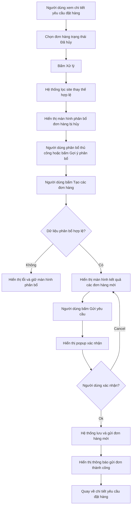
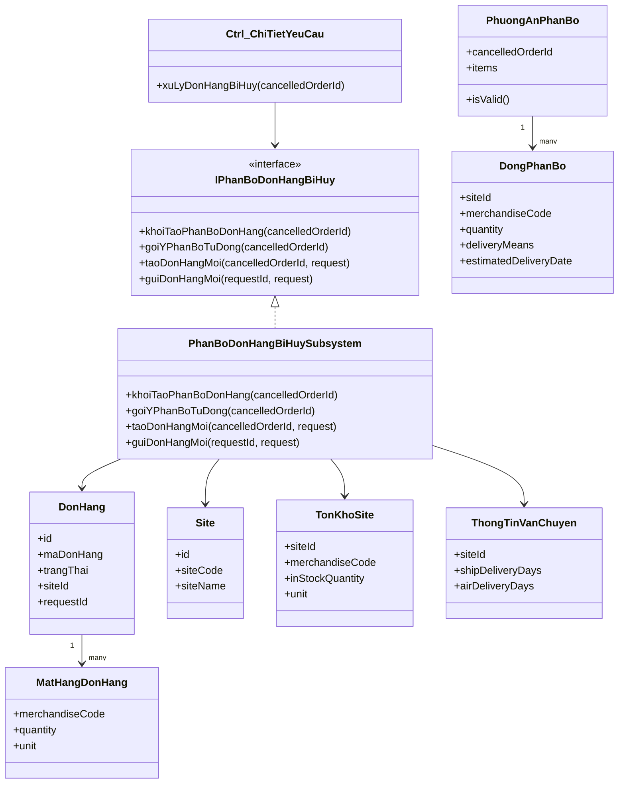
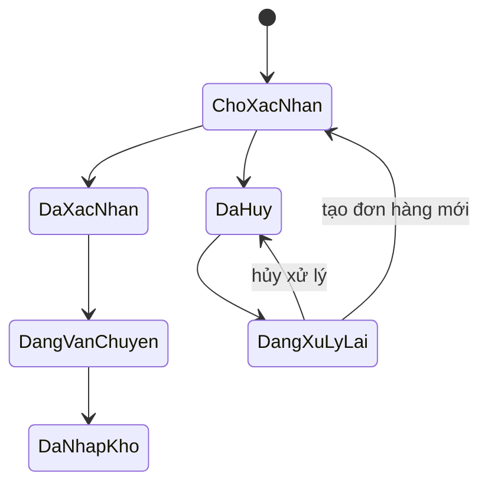
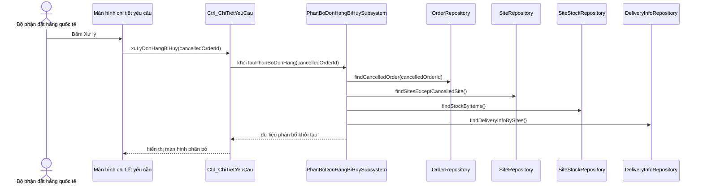
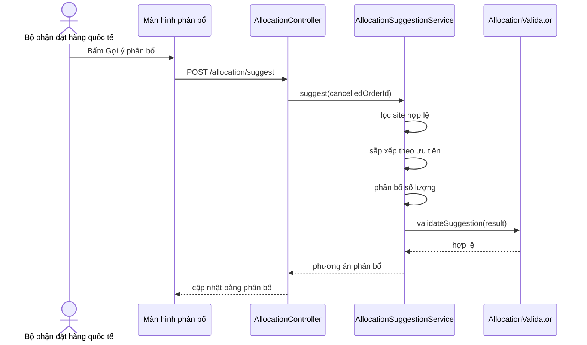
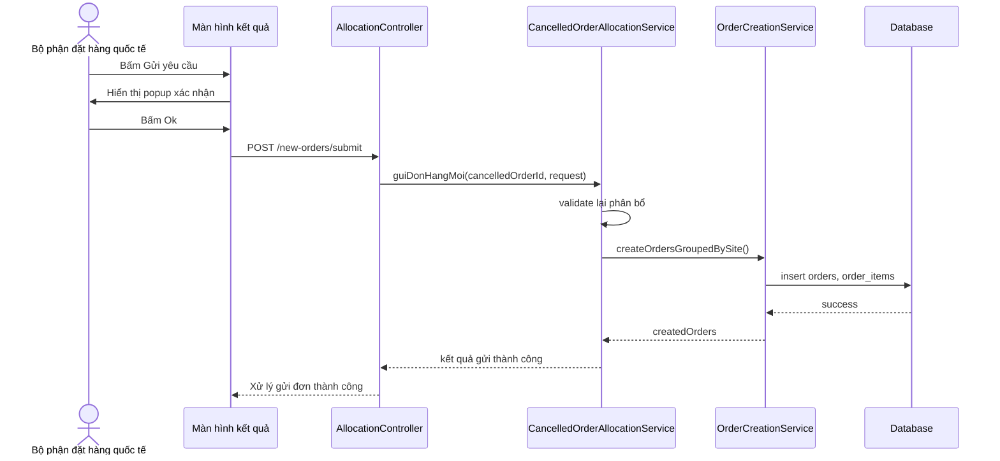

# Use Case UC-DHQT-02 — Xử lý đơn hàng bị hủy


## 1. Bối cảnh hệ thống

Hệ thống đặt hàng nhập khẩu hỗ trợ quy trình từ lúc Bộ phận bán hàng gửi yêu cầu nhập hàng, Bộ phận đặt hàng quốc tế tìm site cung cấp, kiểm tra tồn kho, chọn phương thức vận chuyển, gửi đơn đặt hàng tới site và theo dõi quá trình nhập hàng.

Trong hệ thống, mỗi yêu cầu đặt hàng có thể được phân bổ thành một hoặc nhiều đơn hàng gửi tới các site nhập khẩu khác nhau. Trường hợp một site từ chối hoặc đơn hàng bị hủy, Bộ phận đặt hàng quốc tế cần xử lý lại bằng cách tìm site thay thế, phân bổ lại số lượng hàng và tạo các đơn hàng mới.

---

## 2. Thông tin use case

| Mục | Nội dung |
|---|---|
| Mã use case | `UC-DHQT-02` |
| Tên use case | Xử lý đơn hàng bị hủy |
| Tác nhân chính | Bộ phận đặt hàng quốc tế |
| Mục tiêu | Phân bổ lại các mặt hàng trong đơn hàng bị hủy sang các site khác, sau đó tạo và gửi các đơn hàng mới. |
| Tiền điều kiện | Người dùng đã đăng nhập thành công và đang ở màn hình chi tiết yêu cầu đặt hàng. Tại yêu cầu này có ít nhất một đơn hàng ở trạng thái `Đã hủy`. |
| Hậu điều kiện thành công | Một hoặc nhiều đơn hàng mới được tạo với trạng thái `Chờ xác nhận`, hiển thị cho Bộ phận đặt hàng quốc tế và các site tương ứng. |
| Hậu điều kiện thất bại | Không tạo đơn hàng mới. Dữ liệu phân bổ tạm thời không được lưu hoặc vẫn được giữ trên màn hình tùy ngữ cảnh lỗi. |

---

## 3. Các tác nhân và trách nhiệm liên quan

### 3.1. Bộ phận đặt hàng quốc tế

Là tác nhân chính của use case.

Trách nhiệm:

- Xem đơn hàng bị hủy trong chi tiết yêu cầu đặt hàng.
- Bấm nút xử lý đơn hàng bị hủy.
- Chọn site, phương thức vận chuyển và số lượng đặt cho từng mặt hàng.
- Có thể dùng chức năng gợi ý phân bổ tự động.
- Kiểm tra kết quả tạo đơn hàng mới.
- Gửi yêu cầu đặt hàng mới tới các site.

### 3.2. Site

Là nơi cung cấp hàng hóa.

Trách nhiệm dữ liệu:

- Cung cấp danh sách mặt hàng kinh doanh.
- Cung cấp thông tin tồn kho.
- Cung cấp thời gian vận chuyển bằng đường tàu hoặc hàng không.
- Nhận đơn hàng mới sau khi Bộ phận đặt hàng quốc tế gửi yêu cầu.

### 3.3. Hệ thống

Trách nhiệm:

- Lọc danh sách site thay thế hợp lệ.
- Sắp xếp site theo tiêu chí ưu tiên.
- Kiểm tra dữ liệu phân bổ.
- Tạo đơn hàng mới theo site.
- Gửi yêu cầu tới site.
- Cập nhật trạng thái đơn hàng.
- Hiển thị thông báo thành công/thất bại.

---

## 4. Luồng nghiệp vụ chính



---

## 5. Luồng sự kiện chi tiết

### 5.1. Luồng chính thành công

| Bước | Thực hiện bởi | Hành động |
|---:|---|---|
| 1 | Bộ phận đặt hàng quốc tế | Bấm nút `Xử lý` bên cạnh đơn hàng bị hủy. |
| 2 | Hệ thống | Quét cơ sở dữ liệu để lọc danh sách site thỏa mãn điều kiện. |
| 3 | Hệ thống | Hiển thị danh sách mặt hàng trong đơn và danh sách site khả dụng cho từng mặt hàng. |
| 4 | Bộ phận đặt hàng quốc tế | Chọn site, phương thức vận chuyển và số lượng muốn đặt cho từng mặt hàng. Có thể chọn thủ công hoặc dùng gợi ý tự động. |
| 5 | Bộ phận đặt hàng quốc tế | Bấm `Tạo các đơn hàng`. |
| 6 | Hệ thống | Hiển thị kết quả tạo các đơn hàng mới, gom nhóm theo site. |
| 7 | Bộ phận đặt hàng quốc tế | Bấm `Gửi yêu cầu`. |
| 8 | Hệ thống | Hiển thị hộp thoại xác nhận gửi yêu cầu. |
| 9 | Bộ phận đặt hàng quốc tế | Bấm `Ok`. |
| 10 | Hệ thống | Quay lại giao diện chi tiết yêu cầu đặt hàng và hiển thị thông báo `Xử lý gửi đơn thành công`. |

### 5.2. Luồng thay thế

| Mã luồng | Điều kiện | Hành động hệ thống |
|---|---|---|
| 4a | Có mặt hàng không có site nào cung cấp hoặc tổng tồn kho không đủ số lượng cần đặt | Người dùng bấm `Hủy xử lý`, hệ thống quay lại màn hình chi tiết yêu cầu và hiển thị `Đã hủy xử lý đơn hàng`. |
| 7a | Người dùng muốn chỉnh sửa kết quả tạo đơn hàng | Bấm mũi tên `Quay lại`, hệ thống quay lại màn hình phân bổ. |
| 9a | Người dùng không xác nhận gửi yêu cầu | Bấm `Cancel`, hệ thống đóng popup và quay lại màn hình kết quả đơn hàng mới. |

---

## 6. Quy tắc lọc site thay thế

Khi xử lý đơn hàng bị hủy, hệ thống chỉ lấy các site thỏa mãn tất cả điều kiện sau:

1. Site khác với site vừa từ chối hoặc site của đơn hàng bị hủy.
2. Site có kinh doanh ít nhất một mặt hàng trong đơn hàng bị hủy.
3. Site có tồn kho lớn hơn `0` đối với mặt hàng cần phân bổ.
4. Phương thức vận chuyển của site phải kịp ngày nhận mong muốn.
5. Nếu một site không đủ số lượng, hệ thống cho phép phân bổ một mặt hàng sang nhiều site.

### Công thức kiểm tra thời gian giao hàng

```text
ngay_du_kien_nhan = ngay_gui_don + so_ngay_van_chuyen
site_hop_le_neu ngay_du_kien_nhan <= ngay_nhan_mong_muon
```

---

## 7. Quy tắc ưu tiên chọn site

Site hợp lệ được sắp xếp theo thứ tự ưu tiên giảm dần:

1. Ưu tiên phương thức vận chuyển bằng đường tàu hơn hàng không.
2. Ưu tiên site có tồn kho lớn hơn.
3. Ưu tiên phương án dùng số lượng site ít nhất có thể.

> Gợi ý thiết kế: nên tách logic này thành một service riêng, ví dụ `AllocationSuggestionService`, để dễ kiểm thử và thay đổi thuật toán.

---

## 8. Thuật toán gợi ý phân bổ tự động

### 8.1. Mục tiêu

Tự động tạo phương án phân bổ cho từng mặt hàng sao cho:

- Đủ số lượng cần đặt.
- Không vượt quá tồn kho của từng site.
- Kịp ngày nhận mong muốn.
- Ưu tiên đường tàu.
- Ưu tiên site có tồn kho lớn.
- Giảm số site tham gia nếu có thể.

### 8.2. Pseudocode

```pseudo
function goiYPhanBoTuDong(cancelledOrderId):
    cancelledOrder = orderRepository.findById(cancelledOrderId)
    request = cancelledOrder.purchaseRequest
    result = []

    for each item in cancelledOrder.items:
        requiredQty = item.quantity

        candidateSites = siteRepository.findCandidateSites(
            merchandiseCode = item.merchandiseCode,
            excludedSiteId = cancelledOrder.siteId,
            desiredDeliveryDate = request.desiredDeliveryDate
        )

        candidateSites = filter candidateSites where:
            site.stock[item] > 0
            and estimatedDeliveryDate(site, selectedDeliveryMethod) <= request.desiredDeliveryDate

        sort candidateSites by:
            deliveryMethodPriority(ship before air),
            stock desc

        allocatedQty = 0
        allocations = []

        for each site in candidateSites:
            if allocatedQty == requiredQty:
                break

            qty = min(site.stock[item], requiredQty - allocatedQty)
            allocations.add(site, item, qty, deliveryMethod)
            allocatedQty += qty

        if allocatedQty < requiredQty:
            throw AllocationException("Không đủ tồn kho để phân bổ mặt hàng " + item.code)

        result.add(item, allocations)

    return result
```

### 8.3. Lưu ý khi triển khai

Không nên lưu ngay kết quả gợi ý vào database. Kết quả gợi ý nên được giữ ở client state hoặc server-side draft/session cho tới khi người dùng bấm `Tạo các đơn hàng` hoặc `Gửi yêu cầu`.

---

## 9. Các màn hình trong use case

### 9.1. Màn hình 1 — Phân bổ đơn hàng bị hủy cho các site

#### Mục đích

Cho phép người dùng phân bổ lại từng mặt hàng trong đơn hàng bị hủy sang các site thay thế.

#### Thành phần chính

| Thành phần | Hành vi |
|---|---|
| Tiêu đề màn hình | Hiển thị `Phân bổ đơn hàng bị hủy` và mã yêu cầu liên quan. |
| Nút `Hủy xử lý` | Hủy thao tác phân bổ hiện tại, quay lại màn hình trước. Dữ liệu chưa tạo đơn hàng không được lưu. |
| Khu vực gợi ý tự động | Hiển thị tiêu chí gợi ý: ưu tiên đường tàu, site có tồn kho lớn, số site ít nhất. |
| Nút `Gợi ý phân bổ` | Tự động tính toán phương án phân bổ tối ưu. |
| Khối mặt hàng | Mỗi mặt hàng cần phân bổ lại nằm trong một khối riêng. |
| Badge trạng thái phân bổ | Hiển thị `Cần: x | Đã phân bổ: y`. Tự động cập nhật khi nhập số lượng. |
| Bảng danh sách site | Hiển thị site khả dụng, tồn kho, vận chuyển, trễ dự kiến, số lượng đặt. |
| Nút `Tạo các đơn hàng` | Kiểm tra dữ liệu phân bổ và chuyển sang màn hình kết quả nếu hợp lệ. |

#### Validate màn hình phân bổ

| Quy tắc | Thông báo/Ứng xử |
|---|---|
| Tổng số lượng phân bổ của mặt hàng nhỏ hơn số lượng cần đặt | Không cho tạo đơn hàng, hiển thị lỗi phân bổ thiếu. |
| Số lượng đặt tại một site lớn hơn tồn kho | Hiển thị lỗi tại dòng site tương ứng. |
| Số lượng đặt là số âm hoặc không phải số nguyên | Không chấp nhận input. |
| Có số lượng đặt > 0 nhưng chưa chọn phương thức vận chuyển | Yêu cầu chọn phương thức vận chuyển. |
| Site không kịp ngày nhận mong muốn | Không hiển thị hoặc disable lựa chọn site/phương thức đó. |

---

### 9.2. Màn hình 2 — Kết quả các đơn hàng mới

#### Mục đích

Hiển thị các đơn hàng mới được tạo tạm thời sau khi phân bổ, gom nhóm theo site.

#### Thành phần chính

| Thành phần | Hành vi |
|---|---|
| Tiêu đề màn hình | Hiển thị `Kết quả các đơn hàng mới`. |
| Mã yêu cầu | Hiển thị mã yêu cầu liên quan. |
| Thông tin gom nhóm | Hiển thị cách gom đơn, ví dụ `Gom nhóm theo Site`. |
| Khối đơn hàng theo site | Mỗi site tương ứng một card đơn hàng mới. |
| Bảng mặt hàng | Hiển thị mặt hàng, số lượng, phương thức vận chuyển. |
| Nút `Quay lại` | Quay lại màn hình phân bổ để chỉnh sửa. |
| Nút `Gửi yêu cầu` | Mở popup xác nhận gửi yêu cầu. |

---

### 9.3. Màn hình 3 — Xác nhận gửi yêu cầu

#### Mục đích

Xác nhận lần cuối trước khi gửi các đơn hàng mới tới site.

#### Thành phần chính

| Thành phần | Hành vi |
|---|---|
| Overlay nền mờ | Làm mờ màn hình cha phía sau. |
| Popup xác nhận | Hiển thị ở giữa màn hình. |
| Tiêu đề popup | `Gửi yêu cầu`. |
| Nội dung xác nhận | `Xác nhận gửi yêu cầu xử lý đơn hàng?` |
| Nút `Cancel` | Đóng popup, không gửi yêu cầu, giữ nguyên dữ liệu. |
| Nút `Ok` | Submit dữ liệu các đơn hàng mới. |
| Trạng thái đang gửi | Disable hai nút và hiển thị loading nếu xử lý lâu. |

---

## 10. Thiết kế subsystem

### 10.1. Thông tin subsystem

| Mục | Nội dung |
|---|---|
| Tên subsystem | `PhanBoDonHangBiHuySubsystem` |
| Interface | `IPhanBoDonHangBiHuy` |
| Client sử dụng | `Ctrl_ChiTietYeuCau` |

### 10.2. Các hành vi chính

```java
public interface IPhanBoDonHangBiHuy {
    PhanBoKhoiTaoDTO khoiTaoPhanBoDonHang(Long cancelledOrderId);

    PhuongAnPhanBoDTO goiYPhanBoTuDong(Long cancelledOrderId);

    KetQuaTaoDonHangDTO taoDonHangMoi(Long cancelledOrderId, TaoDonHangMoiRequest request);

    GuiDonHangMoiResult guiDonHangMoi(Long requestId, GuiDonHangMoiRequest request);
}
```

---

## 11. Gợi ý kiến trúc module

```text
cancelled-order-allocation/
├── controller/
│   └── CancelledOrderAllocationController.java
├── service/
│   ├── CancelledOrderAllocationService.java
│   ├── AllocationSuggestionService.java
│   ├── OrderCreationService.java
│   └── OrderSubmissionService.java
├── repository/
│   ├── OrderRepository.java
│   ├── OrderItemRepository.java
│   ├── SiteRepository.java
│   ├── SiteStockRepository.java
│   └── DeliveryInfoRepository.java
├── dto/
│   ├── AllocationInitResponse.java
│   ├── AllocationSuggestionResponse.java
│   ├── CreateNewOrdersRequest.java
│   ├── CreateNewOrdersResponse.java
│   ├── SubmitNewOrdersRequest.java
│   └── SubmitNewOrdersResponse.java
├── entity/
│   ├── PurchaseRequest.java
│   ├── Order.java
│   ├── OrderItem.java
│   ├── Site.java
│   ├── SiteStock.java
│   └── DeliveryInfo.java
└── exception/
    ├── CancelledOrderNotFoundException.java
    ├── InvalidAllocationException.java
    ├── InsufficientStockException.java
    └── DeliveryDateNotSatisfiedException.java
```

---

## 12. Thiết kế class mức phân tích



---

## 13. Trạng thái đơn hàng

Gợi ý state machine:



Các trạng thái cần dùng trong module:

| Trạng thái | Ý nghĩa |
|---|---|
| `DA_HUY` | Đơn hàng cũ đã bị hủy, cần xử lý lại. |
| `DANG_XU_LY_LAI` | Người dùng đang phân bổ lại đơn hàng bị hủy. |
| `CHO_XAC_NHAN` | Đơn hàng mới đã được gửi tới site và chờ site xác nhận. |

---

## 14. Gợi ý API thiết kế

### 14.1. Khởi tạo màn hình phân bổ

```http
GET /api/cancelled-orders/{cancelledOrderId}/allocation/init
```

Response:

```json
{
  "requestId": 421,
  "requestCode": "YC-2026-00421",
  "cancelledOrderId": 1001,
  "cancelledSiteId": 1,
  "desiredDeliveryDate": "2026-06-10",
  "items": [
    {
      "merchandiseCode": "A001",
      "merchandiseName": "Mặt hàng A",
      "requiredQuantity": 20,
      "unit": "pcs",
      "candidateSites": [
        {
          "siteId": 2,
          "siteCode": "ST-002",
          "siteName": "Site 2",
          "inStockQuantity": 25,
          "availableDeliveryMeans": ["SHIP", "AIR"]
        }
      ]
    }
  ]
}
```

### 14.2. Gợi ý phân bổ tự động

```http
POST /api/cancelled-orders/{cancelledOrderId}/allocation/suggest
```

Response:

```json
{
  "items": [
    {
      "merchandiseCode": "A001",
      "requiredQuantity": 20,
      "allocatedQuantity": 20,
      "allocations": [
        {
          "siteId": 2,
          "deliveryMeans": "SHIP",
          "quantity": 20,
          "estimatedDeliveryDate": "2026-06-09"
        }
      ]
    }
  ]
}
```

### 14.3. Tạo các đơn hàng mới tạm thời

```http
POST /api/cancelled-orders/{cancelledOrderId}/new-orders/preview
```

Request:

```json
{
  "allocations": [
    {
      "merchandiseCode": "A001",
      "siteId": 2,
      "deliveryMeans": "SHIP",
      "quantity": 20
    }
  ]
}
```

Response:

```json
{
  "requestId": 421,
  "groupBy": "SITE",
  "newOrders": [
    {
      "temporaryOrderCode": "TEMP-DH-001",
      "siteId": 2,
      "siteName": "Site 2",
      "items": [
        {
          "merchandiseCode": "A001",
          "quantity": 20,
          "unit": "pcs",
          "deliveryMeans": "SHIP"
        }
      ]
    }
  ]
}
```

### 14.4. Gửi yêu cầu tạo đơn hàng mới

```http
POST /api/cancelled-orders/{cancelledOrderId}/new-orders/submit
```

Response:

```json
{
  "message": "Xử lý gửi đơn thành công",
  "createdOrders": [
    {
      "orderId": 2001,
      "orderCode": "DH-2026-001",
      "siteId": 2,
      "status": "CHO_XAC_NHAN"
    }
  ]
}
```

---

## 15. Quy tắc transaction khi gửi đơn hàng mới

Khi người dùng bấm `Ok` ở popup xác nhận, hệ thống nên xử lý trong một transaction:

1. Kiểm tra đơn hàng bị hủy còn tồn tại.
2. Kiểm tra trạng thái đơn hàng cũ vẫn là `DA_HUY`.
3. Validate lại toàn bộ phân bổ ở server.
4. Kiểm tra tồn kho hiện tại của site.
5. Tạo các đơn hàng mới theo từng site.
6. Tạo các dòng mặt hàng trong từng đơn hàng.
7. Gán trạng thái đơn hàng mới là `CHO_XAC_NHAN`.
8. Ghi log xử lý đơn hàng bị hủy.
9. Trả kết quả thành công.

Nếu bất kỳ bước nào lỗi, rollback toàn bộ đơn hàng mới.

---

## 16. Gợi ý database schema

### 16.1. Bảng `orders`

| Cột | Kiểu | Ghi chú |
|---|---|---|
| `id` | bigint | PK |
| `order_code` | varchar | Mã đơn hàng |
| `request_id` | bigint | FK tới yêu cầu đặt hàng |
| `site_id` | bigint | FK tới site |
| `status` | varchar | `DA_HUY`, `CHO_XAC_NHAN`, ... |
| `parent_cancelled_order_id` | bigint | Liên kết đơn hàng mới với đơn hàng bị hủy ban đầu |
| `created_at` | datetime | Ngày tạo |
| `updated_at` | datetime | Ngày cập nhật |

### 16.2. Bảng `order_items`

| Cột | Kiểu | Ghi chú |
|---|---|---|
| `id` | bigint | PK |
| `order_id` | bigint | FK tới orders |
| `merchandise_code` | varchar | Mã hàng |
| `quantity` | int | Số lượng đặt |
| `unit` | varchar | Đơn vị |
| `delivery_means` | varchar | `SHIP` hoặc `AIR` |
| `estimated_delivery_date` | date | Ngày dự kiến nhận |

### 16.3. Bảng `site_stock`

| Cột | Kiểu | Ghi chú |
|---|---|---|
| `site_id` | bigint | FK tới site |
| `merchandise_code` | varchar | Mã hàng |
| `in_stock_quantity` | int | Số lượng tồn kho |
| `unit` | varchar | Đơn vị |

### 16.4. Bảng `delivery_info`

| Cột | Kiểu | Ghi chú |
|---|---|---|
| `site_id` | bigint | FK tới site |
| `ship_delivery_days` | int | Số ngày vận chuyển bằng tàu |
| `air_delivery_days` | int | Số ngày vận chuyển bằng hàng không |
| `other_information` | text | Thông tin khác |

---

## 17. Sequence diagram gợi ý

### 17.1. Khởi tạo phân bổ đơn hàng bị hủy



### 17.2. Gợi ý phân bổ tự động



### 17.3. Tạo và gửi đơn hàng mới



---

## 18. Checklist xử lý lỗi

| Tình huống lỗi | Cách xử lý đề xuất |
|---|---|
| Không tìm thấy đơn hàng bị hủy | Trả lỗi `404 - Cancelled order not found`. |
| Đơn hàng không ở trạng thái `DA_HUY` | Trả lỗi nghiệp vụ, không cho xử lý. |
| Không có site thay thế | Hiển thị thông báo không thể phân bổ. |
| Tổng tồn kho không đủ | Hiển thị mặt hàng bị thiếu số lượng. |
| Ngày giao dự kiến vượt ngày mong muốn | Loại site/phương thức khỏi danh sách chọn. |
| Người dùng nhập số lượng vượt tồn kho | Báo lỗi tại dòng site. |
| Lỗi khi gửi yêu cầu | Không mất dữ liệu màn hình kết quả; cho phép gửi lại. |
| Người dùng bấm Cancel ở popup | Đóng popup và giữ nguyên màn hình kết quả. |

---

## 19. Test case gợi ý

| ID | Trường hợp kiểm thử | Input | Kết quả mong đợi |
|---|---|---|---|
| TC01 | Khởi tạo phân bổ thành công | Đơn hàng bị hủy có mặt hàng A, B | Hiển thị danh sách mặt hàng và site khả dụng. |
| TC02 | Loại site vừa hủy | Site cũ vẫn còn tồn kho | Site cũ không xuất hiện trong danh sách thay thế. |
| TC03 | Ưu tiên đường tàu | Một site có ship kịp ngày nhận | Gợi ý chọn ship trước air. |
| TC04 | Chọn site tồn kho lớn | Nhiều site cùng phương thức ship | Site tồn kho lớn được ưu tiên trước. |
| TC05 | Phân bổ nhiều site | Không site nào đủ toàn bộ số lượng | Hệ thống chia số lượng sang nhiều site. |
| TC06 | Không đủ tồn kho | Tổng tồn kho < số lượng cần đặt | Hiển thị lỗi không đủ tồn kho. |
| TC07 | Nhập số lượng vượt tồn | Người dùng nhập 30, tồn kho 20 | Báo lỗi tại dòng site. |
| TC08 | Thiếu phương thức vận chuyển | SL đặt > 0 nhưng chưa chọn vận chuyển | Không cho tạo đơn hàng. |
| TC09 | Quay lại chỉnh sửa | Từ màn hình kết quả bấm Quay lại | Quay về màn hình phân bổ, giữ dữ liệu đã nhập. |
| TC10 | Cancel popup | Bấm Cancel ở popup xác nhận | Đóng popup, không gửi yêu cầu. |
| TC11 | Gửi thành công | Dữ liệu hợp lệ | Tạo đơn hàng mới trạng thái `CHO_XAC_NHAN`. |
| TC12 | Lỗi submit | Database lỗi hoặc validation server fail | Không tạo đơn hàng dở dang, hiển thị lỗi. |

---

## 20. Prompt có thể đưa vào IDE/AI coding assistant

```text
Bạn là senior software engineer. Hãy dựa trên tài liệu use case UC-DHQT-02 "Xử lý đơn hàng bị hủy" dưới đây để thiết kế module xử lý đơn hàng bị hủy trong hệ thống đặt hàng nhập khẩu.

Yêu cầu:
1. Thiết kế backend theo kiến trúc Controller - Service - Repository.
2. Tạo các DTO request/response cần thiết.
3. Tạo service xử lý các hành vi:
   - khoiTaoPhanBoDonHang
   - goiYPhanBoTuDong
   - taoDonHangMoi
   - guiDonHangMoi
4. Tách riêng thuật toán gợi ý phân bổ vào AllocationSuggestionService.
5. Validate đầy đủ:
   - số lượng không âm
   - không vượt tồn kho
   - tổng phân bổ phải đủ số lượng cần đặt
   - phải chọn phương thức vận chuyển nếu số lượng > 0
   - site phải khác site của đơn hàng bị hủy
   - thời gian giao hàng phải kịp ngày nhận mong muốn
6. Khi submit đơn hàng mới, xử lý trong transaction và rollback nếu lỗi.
7. Tạo unit test cho thuật toán phân bổ và validation.
8. Code cần rõ ràng, dễ đọc, dễ bảo trì.

Use case chi tiết nằm trong file markdown này.
```

---

## 21. Ghi chú triển khai thực tế

- Không tin tưởng hoàn toàn dữ liệu từ frontend; mọi validate quan trọng phải kiểm tra lại ở backend.
- Chức năng `preview` tạo đơn hàng mới chỉ nên tạo dữ liệu xem trước, chưa nên ghi đơn hàng chính thức.
- Chỉ khi người dùng xác nhận `Ok`, hệ thống mới ghi đơn hàng mới vào database.
- Cần lưu liên kết giữa đơn hàng mới và đơn hàng bị hủy bằng `parent_cancelled_order_id` để truy vết.
- Nên ghi log lịch sử xử lý để biết ai đã xử lý đơn hàng bị hủy, xử lý lúc nào và tạo ra những đơn hàng mới nào.
- Nếu tồn kho có thể thay đổi theo thời gian thực, cần kiểm tra lại tồn kho tại thời điểm submit.

---

## 22. Tóm tắt ngắn gọn cho developer

Module này có nhiệm vụ xử lý một đơn hàng đã bị hủy bằng cách:

1. Lấy danh sách mặt hàng trong đơn hàng bị hủy.
2. Tìm các site thay thế hợp lệ.
3. Cho người dùng phân bổ số lượng thủ công hoặc dùng gợi ý tự động.
4. Validate phân bổ.
5. Tạo bản xem trước các đơn hàng mới, gom theo site.
6. Cho người dùng xác nhận gửi yêu cầu.
7. Lưu các đơn hàng mới với trạng thái `CHO_XAC_NHAN`.
8. Hiển thị thông báo thành công và quay về màn hình chi tiết yêu cầu đặt hàng.
