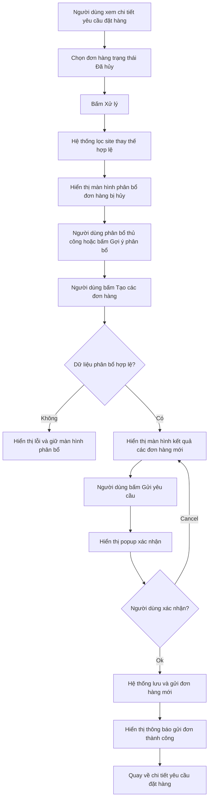
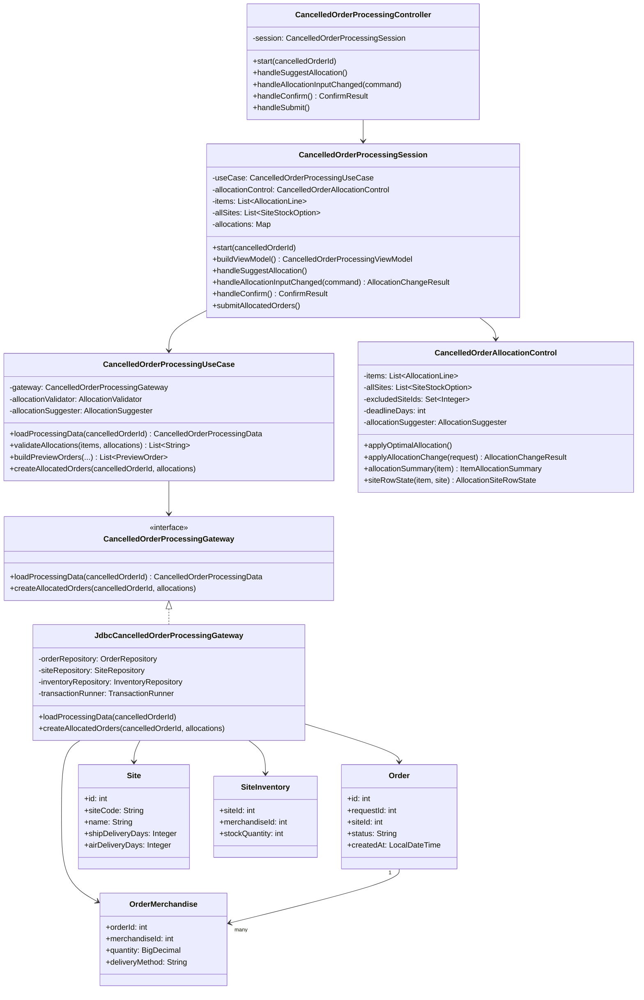
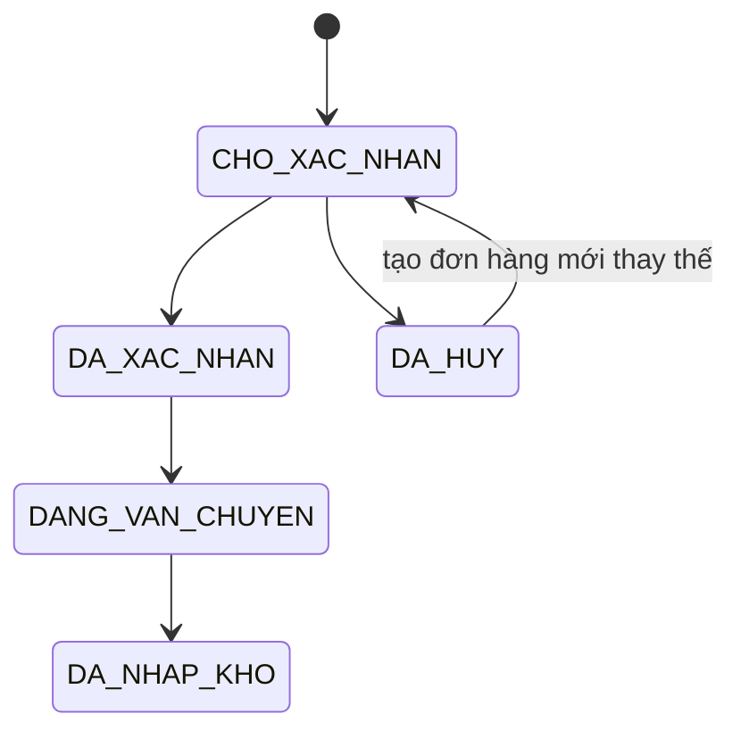
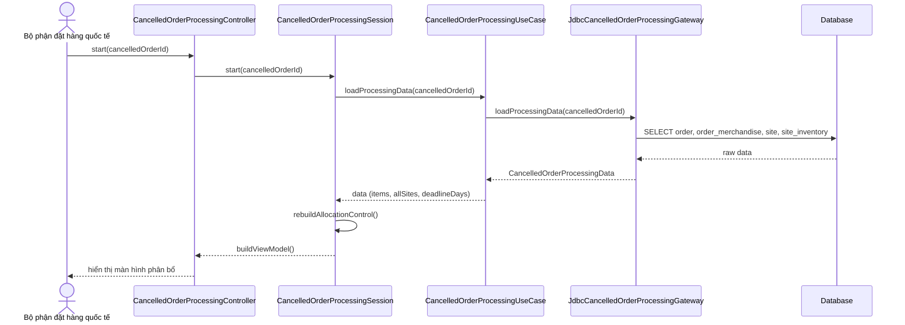
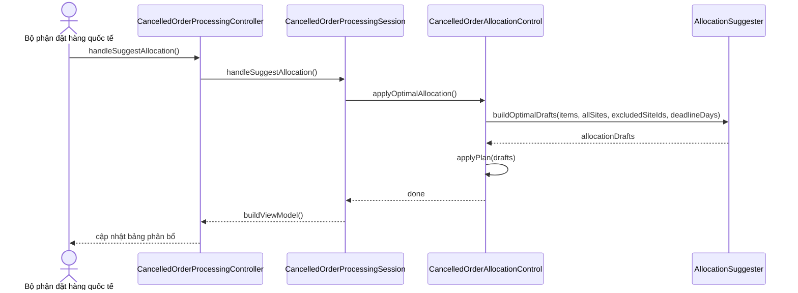
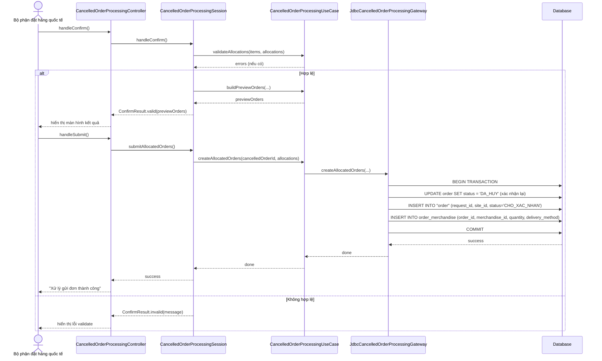

# Use Case UC-DHQT-02 — Xử lý đơn hàng bị hủy


## 1. Bối cảnh hệ thống

Hệ thống đặt hàng nhập khẩu hỗ trợ quy trình từ lúc Bộ phận bán hàng gửi yêu cầu nhập hàng, Bộ phận đặt hàng quốc tế tìm site cung cấp, kiểm tra tồn kho, chọn phương thức vận chuyển, gửi đơn đặt hàng tới site và theo dõi quá trình nhập hàng.

Trong hệ thống, mỗi yêu cầu đặt hàng có thể được phân bổ thành một hoặc nhiều đơn hàng gửi tới các site nhập khẩu khác nhau. Trường hợp một site từ chối hoặc đơn hàng bị hủy, Bộ phận đặt hàng quốc tế cần xử lý lại bằng cách tìm site thay thế, phân bổ lại số lượng hàng và tạo các đơn hàng mới.

---

## 2. Thông tin use case

| Mục | Nội dung |
|---|---|
| Mã use case | `UC-DHQT-02` |
| Tên use case | Xử lý đơn hàng bị hủy |
| Tác nhân chính | Bộ phận đặt hàng quốc tế |
| Mục tiêu | Phân bổ lại các mặt hàng trong đơn hàng bị hủy sang các site khác, sau đó tạo và gửi các đơn hàng mới. |
| Tiền điều kiện | Người dùng đã đăng nhập thành công và đang ở màn hình chi tiết yêu cầu đặt hàng. Tại yêu cầu này có ít nhất một đơn hàng ở trạng thái `DA_HUY`. |
| Hậu điều kiện thành công | Một hoặc nhiều đơn hàng mới được tạo với trạng thái `CHO_XAC_NHAN`, hiển thị cho Bộ phận đặt hàng quốc tế và các site tương ứng. |
| Hậu điều kiện thất bại | Không tạo đơn hàng mới. Dữ liệu phân bổ tạm thời không được lưu hoặc vẫn được giữ trên màn hình tùy ngữ cảnh lỗi. |

---

## 3. Các tác nhân và trách nhiệm liên quan

### 3.1. Bộ phận đặt hàng quốc tế

Là tác nhân chính của use case.

Trách nhiệm:

- Xem đơn hàng bị hủy trong chi tiết yêu cầu đặt hàng.
- Bấm nút xử lý đơn hàng bị hủy.
- Chọn site, phương thức vận chuyển và số lượng đặt cho từng mặt hàng.
- Có thể dùng chức năng gợi ý phân bổ tự động.
- Kiểm tra kết quả tạo đơn hàng mới.
- Gửi yêu cầu đặt hàng mới tới các site.

### 3.2. Site

Là nơi cung cấp hàng hóa.

Trách nhiệm dữ liệu:

- Cung cấp danh sách mặt hàng kinh doanh.
- Cung cấp thông tin tồn kho.
- Cung cấp thời gian vận chuyển bằng đường tàu hoặc hàng không.
- Nhận đơn hàng mới sau khi Bộ phận đặt hàng quốc tế gửi yêu cầu.

### 3.3. Hệ thống

Trách nhiệm:

- Lọc danh sách site thay thế hợp lệ.
- Sắp xếp site theo tiêu chí ưu tiên.
- Kiểm tra dữ liệu phân bổ.
- Tạo đơn hàng mới theo site.
- Gửi yêu cầu tới site.
- Cập nhật trạng thái đơn hàng.
- Hiển thị thông báo thành công/thất bại.

---

## 4. Luồng nghiệp vụ chính



---

## 5. Luồng sự kiện chi tiết

### 5.1. Luồng chính thành công

| Bước | Thực hiện bởi | Hành động |
|---:|---|---|
| 1 | Bộ phận đặt hàng quốc tế | Bấm nút `Xử lý` bên cạnh đơn hàng bị hủy. |
| 2 | Hệ thống | Quét cơ sở dữ liệu để lọc danh sách site thỏa mãn điều kiện. |
| 3 | Hệ thống | Hiển thị danh sách mặt hàng trong đơn và danh sách site khả dụng cho từng mặt hàng. |
| 4 | Bộ phận đặt hàng quốc tế | Chọn site, phương thức vận chuyển và số lượng muốn đặt cho từng mặt hàng. Có thể chọn thủ công hoặc dùng gợi ý tự động. |
| 5 | Bộ phận đặt hàng quốc tế | Bấm `Tạo các đơn hàng`. |
| 6 | Hệ thống | Hiển thị kết quả tạo các đơn hàng mới, gom nhóm theo site. |
| 7 | Bộ phận đặt hàng quốc tế | Bấm `Gửi yêu cầu`. |
| 8 | Hệ thống | Hiển thị hộp thoại xác nhận gửi yêu cầu. |
| 9 | Bộ phận đặt hàng quốc tế | Bấm `Ok`. |
| 10 | Hệ thống | Quay lại giao diện chi tiết yêu cầu đặt hàng và hiển thị thông báo `Xử lý gửi đơn thành công`. |

### 5.2. Luồng thay thế

| Mã luồng | Điều kiện | Hành động hệ thống |
|---|---|---|
| 4a | Có mặt hàng không có site nào cung cấp hoặc tổng tồn kho không đủ số lượng cần đặt | Người dùng bấm `Hủy xử lý`, hệ thống quay lại màn hình chi tiết yêu cầu và hiển thị `Đã hủy xử lý đơn hàng`. |
| 7a | Người dùng muốn chỉnh sửa kết quả tạo đơn hàng | Bấm mũi tên `Quay lại`, hệ thống quay lại màn hình phân bổ. |
| 9a | Người dùng không xác nhận gửi yêu cầu | Bấm `Cancel`, hệ thống đóng popup và quay lại màn hình kết quả đơn hàng mới. |

---

## 6. Quy tắc lọc site thay thế

Khi xử lý đơn hàng bị hủy, hệ thống chỉ lấy các site thỏa mãn tất cả điều kiện sau:

1. Site khác với site vừa từ chối hoặc site của đơn hàng bị hủy.
2. Site có kinh doanh ít nhất một mặt hàng trong đơn hàng bị hủy.
3. Site có tồn kho lớn hơn `0` đối với mặt hàng cần phân bổ.
4. Phương thức vận chuyển của site phải kịp ngày nhận mong muốn.
5. Nếu một site không đủ số lượng, hệ thống cho phép phân bổ một mặt hàng sang nhiều site.

### Công thức kiểm tra thời gian giao hàng

```text
ngay_du_kien_nhan = ngay_gui_don + so_ngay_van_chuyen
site_hop_le_neu ngay_du_kien_nhan <= ngay_nhan_mong_muon
```

---

## 7. Quy tắc ưu tiên chọn site

Site hợp lệ được sắp xếp theo thứ tự ưu tiên giảm dần:

1. Ưu tiên phương thức vận chuyển bằng đường tàu hơn hàng không.
2. Ưu tiên site có tồn kho lớn hơn.
3. Ưu tiên phương án dùng số lượng site ít nhất có thể.

> Logic sắp xếp và gợi ý này được tách vào `AllocationControl` (domain) và `DefaultAllocationSuggester` (strategy), tương tự cách `AllocationControl` + `AllocationSuggester` đang được dùng trong luồng xử lý yêu cầu đặt hàng mới.

---

## 8. Thuật toán gợi ý phân bổ tự động

### 8.1. Mục tiêu

Tự động tạo phương án phân bổ cho từng mặt hàng sao cho:

- Đủ số lượng cần đặt.
- Không vượt quá tồn kho của từng site.
- Kịp ngày nhận mong muốn.
- Ưu tiên đường tàu.
- Ưu tiên site có tồn kho lớn.
- Giảm số site tham gia nếu có thể.

### 8.2. Pseudocode

```pseudo
function goiYPhanBoTuDong(cancelledOrderId):
    cancelledOrder = orderRepository.findById(cancelledOrderId)
    request = cancelledOrder.purchaseRequest
    result = []

    for each item in cancelledOrder.items:
        requiredQty = item.quantity

        candidateSites = siteRepository.findAll()
            .exclude(cancelledOrder.siteId)
            .filter(site => site.stock[item] > 0)
            .filter(site => estimatedDeliveryDate(site) <= request.desiredDeliveryDate)

        sort candidateSites by:
            deliveryMethodPriority(ship before air),
            stock desc

        allocatedQty = 0
        allocations = []

        for each site in candidateSites:
            if allocatedQty == requiredQty: break
            qty = min(site.stock[item], requiredQty - allocatedQty)
            allocations.add(site, item, qty, deliveryMethod)
            allocatedQty += qty

        if allocatedQty < requiredQty:
            throw AllocationException("Không đủ tồn kho để phân bổ mặt hàng " + item.code)

        result.add(item, allocations)

    return result
```

### 8.3. Lưu ý khi triển khai

Không nên lưu ngay kết quả gợi ý vào database. Kết quả gợi ý nên được giữ trong `CancelledOrderProcessingSession` (tương tự `RequestProcessingSession`) cho tới khi người dùng bấm `Tạo các đơn hàng` hoặc `Gửi yêu cầu`.

---

## 9. Các màn hình trong use case

### 9.1. Màn hình 1 — Phân bổ đơn hàng bị hủy cho các site

#### Mục đích

Cho phép người dùng phân bổ lại từng mặt hàng trong đơn hàng bị hủy sang các site thay thế.

#### Thành phần chính

| Thành phần | Hành vi |
|---|---|
| Tiêu đề màn hình | Hiển thị `Phân bổ đơn hàng bị hủy` và mã yêu cầu liên quan. |
| Nút `Hủy xử lý` | Hủy thao tác phân bổ hiện tại, quay lại màn hình trước. Dữ liệu chưa tạo đơn hàng không được lưu. |
| Khu vực gợi ý tự động | Hiển thị tiêu chí gợi ý: ưu tiên đường tàu, site có tồn kho lớn, số site ít nhất. |
| Nút `Gợi ý phân bổ` | Tự động tính toán phương án phân bổ tối ưu. |
| Khối mặt hàng | Mỗi mặt hàng cần phân bổ lại nằm trong một khối riêng. |
| Badge trạng thái phân bổ | Hiển thị `Cần: x | Đã phân bổ: y`. Tự động cập nhật khi nhập số lượng. |
| Bảng danh sách site | Hiển thị site khả dụng, tồn kho, vận chuyển, trễ dự kiến, số lượng đặt. |
| Nút `Tạo các đơn hàng` | Kiểm tra dữ liệu phân bổ và chuyển sang màn hình kết quả nếu hợp lệ. |

#### Validate màn hình phân bổ

| Quy tắc | Thông báo/Ứng xử |
|---|---|
| Tổng số lượng phân bổ của mặt hàng nhỏ hơn số lượng cần đặt | Không cho tạo đơn hàng, hiển thị lỗi phân bổ thiếu. |
| Số lượng đặt tại một site lớn hơn tồn kho | Hiển thị lỗi tại dòng site tương ứng. |
| Số lượng đặt là số âm hoặc không phải số nguyên | Không chấp nhận input. |
| Có số lượng đặt > 0 nhưng chưa chọn phương thức vận chuyển | Yêu cầu chọn phương thức vận chuyển. |
| Site không kịp ngày nhận mong muốn | Không hiển thị hoặc disable lựa chọn site/phương thức đó. |

---

### 9.2. Màn hình 2 — Kết quả các đơn hàng mới

#### Mục đích

Hiển thị các đơn hàng mới được tạo tạm thời sau khi phân bổ, gom nhóm theo site.

#### Thành phần chính

| Thành phần | Hành vi |
|---|---|
| Tiêu đề màn hình | Hiển thị `Kết quả các đơn hàng mới`. |
| Mã yêu cầu | Hiển thị mã yêu cầu liên quan. |
| Thông tin gom nhóm | Hiển thị cách gom đơn, ví dụ `Gom nhóm theo Site`. |
| Khối đơn hàng theo site | Mỗi site tương ứng một card đơn hàng mới. |
| Bảng mặt hàng | Hiển thị mặt hàng, số lượng, phương thức vận chuyển. |
| Nút `Quay lại` | Quay lại màn hình phân bổ để chỉnh sửa. |
| Nút `Gửi yêu cầu` | Mở popup xác nhận gửi yêu cầu. |

---

### 9.3. Màn hình 3 — Xác nhận gửi yêu cầu

#### Mục đích

Xác nhận lần cuối trước khi gửi các đơn hàng mới tới site.

#### Thành phần chính

| Thành phần | Hành vi |
|---|---|
| Overlay nền mờ | Làm mờ màn hình cha phía sau. |
| Popup xác nhận | Hiển thị ở giữa màn hình. |
| Tiêu đề popup | `Gửi yêu cầu`. |
| Nội dung xác nhận | `Xác nhận gửi yêu cầu xử lý đơn hàng?` |
| Nút `Cancel` | Đóng popup, không gửi yêu cầu, giữ nguyên dữ liệu. |
| Nút `Ok` | Submit dữ liệu các đơn hàng mới. |
| Trạng thái đang gửi | Disable hai nút và hiển thị loading nếu xử lý lâu. |

---

## 10. Thiết kế kiến trúc module

Module này tuân theo **Clean Architecture** phân lớp rõ ràng, nhất quán với các module `order` và `request` đang có trong dự án:

```
model/order/                         ← module đơn hàng hiện tại (tái sử dụng)
│
model/cancelledorder/                ← module mới cho UC-DHQT-02
├── CancelledOrderModule.java        ← wiring thủ công (manual DI), tương tự OrderModule
│
├── domain/
│   ├── CancelledOrderAllocationControl.java   ← domain logic: lọc site, validate, gợi ý
│   ├── AllocationLine.java                    ← value object: (siteId, merchandiseId, qty, deliveryMethod)
│   └── CancelledOrderAllocationState.java     ← enum: NONE, PARTIAL, COMPLETE, OVER
│
├── application/
│   ├── CancelledOrderProcessingUseCase.java   ← điều phối use case, tương tự RequestProcessingUseCase
│   ├── CancelledOrderProcessingSession.java   ← trạng thái phiên làm việc, tương tự RequestProcessingSession
│   ├── CancelledOrderProcessingViewModel.java ← dữ liệu render cho View
│   ├── CancelledOrderPreviewBuilder.java      ← build preview orders, tương tự RequestProcessingPreviewBuilder
│   └── port/
│       └── CancelledOrderProcessingGateway.java  ← interface: load data + submit orders
│
├── infrastructure/
│   └── persistence/
│       └── JdbcCancelledOrderProcessingGateway.java  ← implements gateway, thực thi SQL + transaction
│
└── (không có controller trong model — controller nằm ở tầng controller/)

controller/ordering/cancelledorder/
├── CancelledOrderControllerModule.java        ← wiring controller
└── CancelledOrderProcessingController.java    ← nhận sự kiện UI, gọi Session
```

---

## 11. Thiết kế class mức phân tích



---

## 12. Trạng thái đơn hàng



Các trạng thái liên quan đến module này:

| Trạng thái | Hằng số trong code | Ý nghĩa |
|---|---|---|
| `DA_HUY` | `OrderingFormatters.STATUS_CANCELLED` | Đơn hàng cũ đã bị hủy, cần xử lý lại. |
| `CHO_XAC_NHAN` | `OrderingFormatters.STATUS_PENDING` | Đơn hàng mới đã được gửi tới site, chờ site xác nhận. |

> Sử dụng lại hằng số `OrderingFormatters.STATUS_CANCELLED` và `STATUS_PENDING` từ `model/shared/formatting/OrderingFormatters.java`, nhất quán với `OrderCancellationApplicationService`.

---

## 13. Sequence diagram

### 13.1. Khởi tạo màn hình phân bổ đơn hàng bị hủy



### 13.2. Gợi ý phân bổ tự động



### 13.3. Tạo và gửi đơn hàng mới



---

## 14. Thiết kế các lớp chính

### 14.1. `CancelledOrderProcessingData` — dữ liệu load từ gateway

```java
// model/cancelledorder/application/
public record CancelledOrderProcessingData(
    int cancelledOrderId,
    int requestId,
    int cancelledSiteId,
    LocalDate desiredDeliveryDate,
    int deadlineDays,
    List<ItemRequirement> items,       // tái sử dụng từ model/request/domain/processing/
    List<SiteStockOption> sites        // tái sử dụng từ model/request/domain/processing/
) {}
```

### 14.2. `CancelledOrderProcessingGateway` — port interface

```java
// model/cancelledorder/application/port/
public interface CancelledOrderProcessingGateway {
    CancelledOrderProcessingData loadProcessingData(int cancelledOrderId)
        throws CancelledOrderGatewayException;

    void createAllocatedOrders(int cancelledOrderId,
        Map<Integer, Map<Integer, Allocation>> allocations)
        throws CancelledOrderGatewayException;
}
```

### 14.3. `CancelledOrderProcessingUseCase` — điều phối use case

```java
// model/cancelledorder/application/
public final class CancelledOrderProcessingUseCase {

    private final CancelledOrderProcessingGateway gateway;
    private final AllocationValidator allocationValidator;    // tái sử dụng
    private final AllocationSuggester allocationSuggester;   // tái sử dụng

    public CancelledOrderProcessingData loadProcessingData(int cancelledOrderId) { ... }

    public List<String> validateAllocations(
        List<ItemRequirement> items,
        Map<Integer, Map<Integer, Allocation>> allocations
    ) { ... }

    public List<PreviewOrder> buildPreviewOrders(
        List<ItemRequirement> items,
        List<SiteStockOption> allSites,
        Map<Integer, Map<Integer, Allocation>> allocations,
        LocalDate desiredDeliveryDate
    ) { ... }

    public void createAllocatedOrders(
        int cancelledOrderId,
        Map<Integer, Map<Integer, Allocation>> allocations
    ) throws CancelledOrderProcessingException { ... }
}
```

### 14.4. `CancelledOrderProcessingSession` — trạng thái phiên làm việc

```java
// model/cancelledorder/application/
public final class CancelledOrderProcessingSession {

    private final CancelledOrderProcessingUseCase useCase;
    private final List<ItemRequirement> items = new ArrayList<>();
    private final List<SiteStockOption> allSites = new ArrayList<>();
    private final Map<Integer, Map<Integer, Allocation>> allocations = new LinkedHashMap<>();

    private int cancelledOrderId = -1;
    private int cancelledSiteId = -1;
    private int deadlineDays = 14;
    private LocalDate desiredDeliveryDate;
    private CancelledOrderAllocationControl allocationControl;

    public void start(int cancelledOrderId) { ... }

    public CancelledOrderProcessingViewModel buildViewModel() { ... }

    public void handleSuggestAllocation() {
        allocationControl.applyOptimalAllocation();
    }

    public AllocationChangeResultView handleAllocationInputChanged(AllocationChangeCommand command) { ... }

    public ConfirmResult handleConfirm() { ... }

    public void submitAllocatedOrders() throws CancelledOrderProcessingException {
        useCase.createAllocatedOrders(cancelledOrderId, allocations);
    }

    public record ConfirmResult(String validationMessage, List<ProcessingPreviewOrderView> previewOrders) {
        public static ConfirmResult invalid(String message) { ... }
        public static ConfirmResult valid(List<ProcessingPreviewOrderView> orders) { ... }
        public boolean valid() { return validationMessage == null; }
    }
}
```

### 14.5. `CancelledOrderProcessingController` — tầng controller

```java
// controller/ordering/cancelledorder/
public final class CancelledOrderProcessingController {

    private final CancelledOrderProcessingSession session;

    public CancelledOrderProcessingController(CancelledOrderProcessingSession session) {
        this.session = Objects.requireNonNull(session, "session");
    }

    public void start(int cancelledOrderId) {
        session.start(cancelledOrderId);
    }

    public CancelledOrderProcessingViewModel buildViewModel() {
        return session.buildViewModel();
    }

    public void handleSuggestAllocation() {
        session.handleSuggestAllocation();
    }

    public AllocationChangeResultView handleAllocationInputChanged(AllocationChangeCommand command) {
        return session.handleAllocationInputChanged(command);
    }

    public CancelledOrderProcessingSession.ConfirmResult handleConfirm() {
        return session.handleConfirm();
    }

    public void handleSubmit() throws CancelledOrderProcessingException {
        session.submitAllocatedOrders();
    }
}
```

### 14.6. `CancelledOrderModule` — wiring thủ công

```java
// model/cancelledorder/
public final class CancelledOrderModule {

    private final CancelledOrderProcessingUseCase cancelledOrderProcessingUseCase;

    public CancelledOrderModule(
        ConnectionProvider connectionProvider,
        TransactionRunner transactionRunner,
        OrderModule orderModule,
        SiteModule siteModule,
        CatalogModule catalogModule
    ) {
        CancelledOrderProcessingGateway gateway = new JdbcCancelledOrderProcessingGateway(
            orderModule.orderRepository(),
            siteModule.siteRepository(),
            siteModule.inventoryRepository(),
            transactionRunner
        );
        this.cancelledOrderProcessingUseCase = new CancelledOrderProcessingUseCase(gateway);
    }

    public CancelledOrderProcessingUseCase cancelledOrderProcessingUseCase() {
        return cancelledOrderProcessingUseCase;
    }

    // Session không phải singleton — khởi tạo mới mỗi lần mở màn hình
    public CancelledOrderProcessingSession newSession() {
        return new CancelledOrderProcessingSession(cancelledOrderProcessingUseCase);
    }
}
```

---

## 15. Quy tắc transaction khi gửi đơn hàng mới

Khi người dùng bấm `Ok` ở popup xác nhận, `JdbcCancelledOrderProcessingGateway.createAllocatedOrders()` thực thi trong một transaction duy nhất (dùng `TransactionRunner`, tương tự `JdbcRequestProcessingGateway`):

1. Kiểm tra đơn hàng bị hủy còn tồn tại (`OrderRepository.findById`).
2. Kiểm tra trạng thái đơn hàng cũ vẫn là `DA_HUY`.
3. Validate lại toàn bộ phân bổ ở server.
4. Kiểm tra tồn kho hiện tại của từng site (`InventoryRepository.getStockQuantity`).
5. Tạo các đơn hàng mới theo từng site (`OrderRepository.create`).
6. Tạo các dòng mặt hàng trong từng đơn hàng (`OrderRepository.addItem`).
7. Gán trạng thái đơn hàng mới là `CHO_XAC_NHAN`.
8. Ghi log xử lý đơn hàng bị hủy.
9. Trả kết quả thành công.

Nếu bất kỳ bước nào lỗi, rollback toàn bộ — không có đơn hàng nào được tạo dở dang.

---

## 16. Tái sử dụng từ các module hiện có

| Thành phần cần | Lấy từ đâu |
|---|---|
| `OrderRepository` (findById, create, addItem, updateStatus) | `model/order/application/port/OrderRepository` |
| `SiteRepository` (findAll) | `model/site/application/port/SiteRepository` |
| `InventoryRepository` (getStockQuantity) | `model/site/application/port/InventoryRepository` |
| `ItemRequirement` | `model/request/domain/processing/ItemRequirement` |
| `SiteStockOption` | `model/request/domain/processing/SiteStockOption` |
| `Allocation` | `model/request/domain/allocation/model/Allocation` |
| `AllocationValidator` / `DefaultAllocationValidator` | `model/request/domain/allocation/validator/` |
| `AllocationSuggester` / `DefaultAllocationSuggester` | `model/request/domain/allocation/suggester/` |
| `AllocationChangeCommand` | `model/request/application/processing/AllocationChangeCommand` |
| `TransactionRunner` | `model/shared/database/TransactionRunner` |
| `OrderingFormatters` (status constants) | `model/shared/formatting/OrderingFormatters` |

> Tái sử dụng tối đa các lớp đã có. **Không** tạo lại `AllocationSuggester`, `AllocationValidator`, `Allocation`, `ItemRequirement`, `SiteStockOption` — chỉ tạo module mới bao bọc chúng cho use case cụ thể này.

---

## 17. Gợi ý database schema

### 17.1. Bảng `order` (hiện có)

| Cột | Kiểu | Ghi chú |
|---|---|---|
| `id` | bigint | PK |
| `request_id` | bigint | FK tới purchase_request |
| `site_id` | bigint | FK tới site |
| `status` | varchar | `DA_HUY`, `CHO_XAC_NHAN`, ... |
| `created_at` | datetime | Ngày tạo |

> Không cần thêm cột `parent_cancelled_order_id` nếu chỉ cần truy vết qua `request_id`. Nếu cần liên kết rõ ràng giữa đơn hàng mới và đơn hàng bị hủy, thêm cột `source_cancelled_order_id bigint NULL`.

### 17.2. Bảng `order_merchandise` (hiện có)

| Cột | Kiểu | Ghi chú |
|---|---|---|
| `order_id` | bigint | FK tới order |
| `merchandise_id` | bigint | FK tới merchandise |
| `quantity` | numeric | Số lượng đặt |
| `delivery_method` | varchar | `SHIP` hoặc `AIR` |

### 17.3. Bảng `site_inventory` (hiện có — dùng `InventoryRepository`)

| Cột | Kiểu | Ghi chú |
|---|---|---|
| `site_id` | bigint | FK tới site |
| `merchandise_id` | bigint | FK tới merchandise |
| `stock_quantity` | int | Số lượng tồn kho |

---

## 18. Checklist xử lý lỗi

| Tình huống lỗi | Cách xử lý đề xuất |
|---|---|
| Không tìm thấy đơn hàng bị hủy | Ném `CancelledOrderGatewayException`, Session trả về màn hình rỗng. |
| Đơn hàng không ở trạng thái `DA_HUY` | Validate trong gateway, rollback và báo lỗi nghiệp vụ. |
| Không có site thay thế | `allSites` rỗng sau lọc — Session hiển thị thông báo không thể phân bổ. |
| Tổng tồn kho không đủ | `AllocationValidator` báo lỗi khi `validateAllocations`. |
| Người dùng nhập số lượng vượt tồn | `AllocationControl.applyAllocationChange` trả `EXCEEDS_STOCK`. |
| Thiếu phương thức vận chuyển | `AllocationValidator` báo lỗi thiếu transport khi validate. |
| Lỗi khi submit | `CancelledOrderProcessingException` — không mất dữ liệu Session, cho phép thử lại. |
| Người dùng bấm Cancel ở popup | Đóng popup, Session vẫn giữ nguyên trạng thái. |

---

## 19. Test case gợi ý

| ID | Trường hợp kiểm thử | Input | Kết quả mong đợi |
|---|---|---|---|
| TC01 | Khởi tạo phân bổ thành công | Đơn hàng bị hủy có mặt hàng A, B | Hiển thị danh sách mặt hàng và site khả dụng. |
| TC02 | Loại site vừa hủy | Site cũ vẫn còn tồn kho | Site cũ không xuất hiện trong danh sách thay thế (`excludedSiteIds`). |
| TC03 | Ưu tiên đường tàu | Một site có ship kịp ngày nhận | `DefaultAllocationSuggester` gợi ý chọn ship trước air. |
| TC04 | Chọn site tồn kho lớn | Nhiều site cùng phương thức ship | Site tồn kho lớn được ưu tiên trước. |
| TC05 | Phân bổ nhiều site | Không site nào đủ toàn bộ số lượng | Hệ thống chia số lượng sang nhiều site. |
| TC06 | Không đủ tồn kho | Tổng tồn kho < số lượng cần đặt | `AllocationValidator` báo lỗi không đủ tồn kho. |
| TC07 | Nhập số lượng vượt tồn | Người dùng nhập 30, tồn kho 20 | `AllocationControl` trả `EXCEEDS_STOCK`. |
| TC08 | Thiếu phương thức vận chuyển | SL đặt > 0 nhưng chưa chọn vận chuyển | `AllocationValidator` không cho tạo đơn hàng. |
| TC09 | Quay lại chỉnh sửa | Từ màn hình kết quả bấm Quay lại | Session giữ nguyên `allocations`, quay về màn hình phân bổ. |
| TC10 | Cancel popup | Bấm Cancel ở popup xác nhận | Đóng popup, Session không thay đổi. |
| TC11 | Gửi thành công | Dữ liệu hợp lệ | Tạo đơn hàng mới trạng thái `CHO_XAC_NHAN`. |
| TC12 | Lỗi submit (DB lỗi) | Database exception | Rollback toàn bộ, không tạo đơn hàng dở dang, hiển thị lỗi. |

---

## 20. Tóm tắt ngắn gọn cho developer

Module này xử lý đơn hàng bị hủy bằng cách:

1. Lấy danh sách mặt hàng trong đơn hàng bị hủy từ `OrderRepository`.
2. Lọc site thay thế (loại site cũ, chỉ lấy site có tồn kho, kịp ngày nhận).
3. Cho người dùng phân bổ số lượng thủ công hoặc dùng `DefaultAllocationSuggester`.
4. `AllocationValidator` validate phân bổ.
5. `CancelledOrderPreviewBuilder` build bản xem trước đơn hàng mới, gom theo site.
6. Cho người dùng xác nhận gửi yêu cầu.
7. `JdbcCancelledOrderProcessingGateway` lưu các đơn hàng mới trong một transaction.
8. Hiển thị thông báo thành công và quay về màn hình chi tiết yêu cầu đặt hàng.

**Nguyên tắc quan trọng:**

- Không tin tưởng dữ liệu từ frontend; mọi validate quan trọng đều thực hiện ở `AllocationValidator` trước khi gọi gateway.
- Session không phải singleton — khởi tạo mới mỗi khi người dùng mở màn hình xử lý.
- Transaction nằm hoàn toàn trong `JdbcCancelledOrderProcessingGateway`, không rò rỉ lên tầng trên.
- Tái sử dụng `AllocationSuggester`, `AllocationValidator`, `Allocation`, `ItemRequirement`, `SiteStockOption` từ module `request` — không duplicate code.
